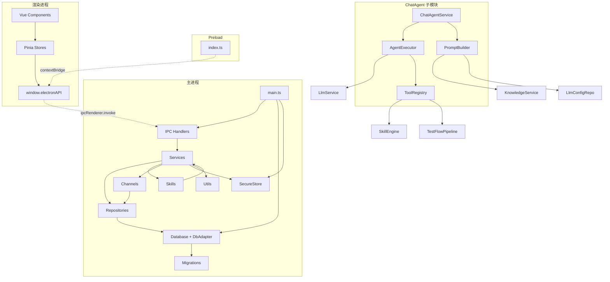
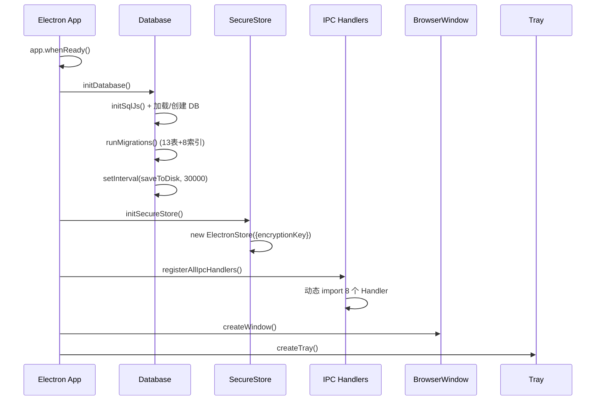

# OmniTestAgent 整体架构文档

## 修改历史

| 日期       | 版本  | 描述         | 作者  |
| ---------- | ----- | ------------ | ----- |
| 2026-05-24 | v1.0  | 初始版本     | CodeArts |

---

## 1. 项目概述

OmniTestAgent 是一个基于 **LLM + 知识库 + Skills/MCP** 框架的智能测试 Agent 桌面应用。它将大语言模型（LLM）的推理能力、知识库（RAG）的领域知识、Skills 体系的测试流程编排、以及 MCP（Model Context Protocol）的外部工具调用能力整合于一体，实现从需求解析到测试脚本生成的全链路自动化测试设计。

### 核心功能

| 功能域         | 描述                                                       |
| -------------- | ---------------------------------------------------------- |
| 项目管理       | 多项目管理，统计测试用例/活动/知识库数量                    |
| AI 对话        | 基于 OpenAI 协议的 LLM 对话，支持流式输出；ChatAgent 引擎驱动多轮工具调用，支持多 Provider（openai/anthropic/azure/local） |
| 测试设计流程   | 9 步流水线编排（需求导入→解析→审核→设计→审核→用例→审核→脚本→调试） |
| 知识库管理     | 文档上传、分块、向量化、检索（RAG）                         |
| LLM 配置       | 多 Provider 支持（openai/anthropic/azure/local），模型/URL/API Key 管理，连接测试，字段名统一（apiKey/baseUrl/modelName） |
| MCP 配置       | HTTP/Stdio 两种传输协议，工具发现与调用                     |
| Skills 管理    | 4 个内置 Skill（需求解析/测试设计/用例生成/脚本生成），可启用/禁用 |
| Channels 配置  | QQ Bot / WeLink Bot 消息渠道配置与发送                     |
| 加密存储       | AES-256-GCM 加密 API Key，electron-store 安全持久化        |
| 斜杠命令       | /analyze、/design、/cases、/script 快捷触发对应 Skill 工具 |
| @文件引用      | 消息中 @filename 自动解析并注入文件内容到上下文           |
| 审批机制       | 工具执行前人工审批（MANUAL_APPROVAL_TOOLS），支持批准/拒绝，超时 120s 自动拒绝 |

---

## 2. 技术栈

| 层级         | 技术                                        | 版本       |
| ------------ | ------------------------------------------- | ---------- |
| 桌面框架     | Electron                                    | ^28.3.3    |
| 前端框架     | Vue 3 (Composition API)                     | ^3.5.0     |
| 状态管理     | Pinia                                       | ^3.0.0     |
| 路由         | Vue Router (Hash 模式)                      | ^4.5.0     |
| UI 组件库    | Arco Design Vue                             | ^2.57.0    |
| 数据库       | sql.js (SQLite WASM)                        | ^1.11.0    |
| 安全存储     | electron-store                              | ^10.0.0    |
| LLM 客户端   | openai                                      | ^4.73.0    |
| 图表         | echarts                                     | ^5.6.0     |
| Markdown     | marked + highlight.js                       | ^15.0.0    |
| 构建工具     | Vite (渲染进程) + tsc (主进程/预加载)       | Vite ^6.0.0 |
| 样式         | TailwindCSS v4                              | ^4.0.0     |
| 测试         | Vitest + @vue/test-utils + happy-dom        | ^4.1.7     |
| 打包         | electron-builder                            | ^25.1.0    |

---

## 3. 整体架构图

```
┌──────────────────────────────────────────────────────────────────────┐
│                       Electron BrowserWindow                        │
│  ┌────────────────────────────────────────────────────────────────┐  │
│  │                    渲染进程 (Renderer)                         │  │
│  │  ┌──────────┐  ┌──────────┐  ┌──────────┐  ┌──────────────┐  │  │
│  │  │ Vue 组件  │→│  Pinia   │→│ IPC 桥接 │→│ window.      │  │  │
│  │  │ (Views)  │  │ (Stores) │  │ (Compos- │  │ electronAPI  │  │  │
│  │  └──────────┘  └──────────┘  │ ables)   │  └──────┬───────┘  │  │
│  │                               └──────────┘         │          │  │
│  └────────────────────────────────────────────────────┼──────────┘  │
│                                                       │ IPC        │
│  ┌────────────────────────────────────────────────────┼──────────┐  │
│  │                  Preload 桥接层                    │          │  │
│  │    contextBridge.exposeInMainWorld('electronAPI')  │          │  │
│  └────────────────────────────────────────────────────┼──────────┘  │
│                                                       │            │
│  ┌────────────────────────────────────────────────────┼──────────┐  │
│  │                   主进程 (Main)                    │          │  │
│  │  ┌──────────┐  ┌──────────┐  ┌──────────┐  ┌─────┴──────┐  │  │
│  │  │ IPC 层   │→│ Service  │→│Repository │→│  Database   │  │  │
│  │  │ (Handlers)│  │ (业务)   │  │ (数据)   │  │  (sql.js)  │  │  │
│  │  └──────────┘  └──────────┘  └──────────┘  └────────────┘  │  │
│  │  ┌──────────┐  ┌──────────┐  ┌──────────┐  ┌──────────────┐ │  │
│  │  │ Skills   │  │ Channels │  │  Utils   │  │ SecureStore  │ │  │
│  │  │ (4内置)  │  │ (QQ/Welink)│ │ (加密等) │  │ (electron-  │ │  │
│  │  └──────────┘  └──────────┘  └──────────┘  │  store)      │ │  │
│  │                                              └──────────────┘ │  │
│  └────────────────────────────────────────────────────────────────┘  │
└──────────────────────────────────────────────────────────────────────┘
```

---

## 4. 目录结构

```
OmniTestAgent/
├── electron/                          # 主进程源码（开发时引用，编译源自 src/main）
├── src/
│   ├── main/                          # 主进程 TypeScript 源码
│   │   ├── channels/                  # 消息渠道客户端
│   │   │   ├── qqBotClient.ts
│   │   │   └── welinkBotClient.ts
│   │   ├── data/                      # 数据层
│   │   │   ├── database.ts            # sql.js 初始化与持久化
│   │   │   ├── dbAdapter.ts           # DbAdapter 泛型适配器
│   │   │   ├── secureStore.ts         # 加密配置存储
│   │   │   ├── migrations/
│   │   │   │   └── 001_initial.ts     # 建表迁移
│   │   │   └── repositories/          # Repository 实现
│   │   │       ├── ChannelConfigRepo.ts
│   │   │       ├── ChatRepo.ts
│   │   │       ├── FlowActivityRepo.ts
│   │   │       ├── KnowledgeRepo.ts
│   │   │       ├── LlmConfigRepo.ts
│   │   │       ├── McpConfigRepo.ts
│   │   │       ├── ProjectRepo.ts
│   │   │       ├── SkillRepo.ts
│   │   │       └── TestCaseRepo.ts
│   │   ├── ipc/                       # IPC Handler 注册
│   │   │   ├── index.ts               # 统一注册入口
│   │   │   ├── helpers.ts             # 通用注册辅助
│   │   │   ├── projectHandler.ts
│   │   │   ├── llmHandler.ts
│   │   │   ├── knowledgeHandler.ts
│   │   │   ├── mcpHandler.ts
│   │   │   ├── skillHandler.ts
│   │   │   ├── channelHandler.ts
│   │   │   ├── testflowHandler.ts
│   │   │   └── storeHandler.ts
│   │   ├── services/                  # 业务服务层
│   │   │   ├── ChannelManager.ts
│   │   │   ├── KnowledgeService.ts
│   │   │   ├── LlmService.ts
│   │   │   ├── McpService.ts
│   │   │   ├── ProjectService.ts
│   │   │   ├── SkillEngine.ts
│   │   │   ├── SkillRegistry.ts
│   │   │   ├── TestFlowOrchestrator.ts
│   │   │   ├── TestFlowPipelineService.ts
│   │   │   ├── FileOperationService.ts
│   │   │   └── chat/                 # ChatAgent 子模块
│   │   │       ├── chatAgentService.ts  #  会话管理、审批转发
│   │   │       ├── agentExecutor.ts     #  Agent 执行循环（AsyncGenerator）
│   │   │       ├── toolRegistry.ts      #  9 工具注册与执行
│   │   │       └── promptBuilder.ts     #  8 层 Prompt 注入
│   │   ├── skills/                    # Skill 实现
│   │   │   ├── skillInterface.ts
│   │   │   ├── requirementParser/index.ts
│   │   │   ├── testDesigner/index.ts
│   │   │   ├── caseGenerator/index.ts
│   │   │   └── scriptGenerator/index.ts
│   │   ├── utils/                     # 工具函数
│   │   │   ├── crypto.ts              # AES-256-GCM 加解密
│   │   │   ├── documentParser.ts      # 文档解析与分块
│   │   │   ├── fileHelper.ts          # 文件操作与校验
│   │   │   ├── logger.ts              # 日志系统
│   │   │   └── machineId.ts           # 机器标识
│   │   ├── vector/                    # 向量存储（预留目录）
│   │   └── main.ts                    # Electron 主进程入口
│   ├── preload/
│   │   └── index.ts                   # Preload 脚本
│   └── renderer/                      # 渲染进程
│       ├── assets/
│       │   └── main.css
│       ├── components/
│       │   ├── common/
│       │   │   ├── ConfirmDialog.vue
│       │   │   └── StatusIcon.vue
│       │   └── layout/
│       │       ├── AppLayout.vue
│       │       ├── ProjectSelector.vue
│       │       ├── SideMenu.vue
│       │       └── TopNavBar.vue
│       ├── composables/
│       │   ├── useIpcCall.ts
│       │   ├── useLoading.ts
│       │   └── useNotification.ts
│       ├── features/                  # 功能模块（按业务域划分）
│       │   ├── dashboard/views/DashboardView.vue
│       │   ├── project/views/ProjectManagementView.vue
│       │   ├── chat/views/ChatView.vue
│       │   ├── testflow/views/TestFlowView.vue
│       │   ├── execution/views/TestExecutionView.vue
│       │   ├── knowledge/views/KnowledgeView.vue
│       │   ├── llm-config/views/LlmConfigView.vue
│       │   ├── mcp-config/views/McpConfigView.vue
│       │   ├── skills/views/SkillsView.vue
│       │   └── channels/views/ChannelsView.vue
│       ├── router/
│       │   └── index.ts
│       ├── store/                     # 9 个 Pinia Store
│       │   ├── useAppStore.ts
│       │   ├── useProjectStore.ts
│       │   ├── useChatStore.ts
│       │   ├── useKnowledgeStore.ts
│       │   ├── useLlmConfigStore.ts
│       │   ├── useMcpConfigStore.ts
│       │   ├── useSkillStore.ts
│       │   ├── useChannelStore.ts
│       │   └── useTestFlowStore.ts
│       ├── types/                     # TypeScript 类型定义
│       │   ├── electron-api.d.ts      # IPC 类型根基
│       │   ├── project.ts
│       │   ├── chat.ts
│       │   ├── knowledge.ts
│       │   ├── llm.ts
│       │   ├── mcp.ts
│       │   ├── skill.ts
│       │   ├── channel.ts
│       │   └── testflow.ts
│       ├── utils/
│       │   ├── constants.ts
│       │   ├── formatter.ts
│       │   └── validator.ts
│       ├── App.vue
│       └── main.ts
├── scripts/
│   ├── build.js                       # 生产构建脚本
│   └── dev.js                         # 开发启动脚本
├── resources/                         # 应用资源（托盘图标等）
├── dist/                              # 构建输出
│   ├── main/                          # 主进程编译输出
│   ├── preload/                       # Preload 编译输出
│   └── renderer/                      # 渲染进程构建输出
├── tests/                             # 测试文件
├── docs/
│   ├── design/                        # 架构设计文档
│   └── experience/                    # 经验总结
├── package.json
├── vite.config.ts
├── tsconfig.json
├── tsconfig.main.json
├── tsconfig.preload.json
├── tsconfig.web.json
├── tsconfig.node.json
└── vitest.config.ts
```

---

## 5. 分层设计

### 5.1 Electron 主进程分层

主进程严格遵循 **IPC 层 → Service 层 → Repository 层 → Database 层** 的单向依赖原则：

```
┌─────────────────────────────────────────────┐
│  IPC 层 (ipc/)                              │
│  - 接收渲染进程请求，调用 Service            │
│  - 统一错误处理（helpers.ts）               │
│  - 通道命名: domain:action                  │
├─────────────────────────────────────────────┤
│  Service 层 (services/)                     │
│  - 业务逻辑编排                             │
│  - 调用 Repository + 外部服务 (LLM/MCP)     │
│  - 管理生命周期（客户端连接/释放）           │
├─────────────────────────────────────────────┤
│  Repository 层 (data/repositories/)         │
│  - 纯数据访问，无业务逻辑                   │
│  - 通过 DbAdapter 操作 SQLite               │
│  - 导出单例实例                             │
├─────────────────────────────────────────────┤
│  Database 层 (data/)                        │
│  - sql.js 初始化与持久化                    │
│  - DbAdapter 泛型 SQL 操作                  │
│  - 迁移管理                                 │
│  - SecureStore 加密配置                     │
└─────────────────────────────────────────────┘
```

**约束规则**：
- IPC 层只依赖 Service 层，不直接访问 Repository
- Service 层只依赖 Repository 层和外部 SDK
- Repository 层只依赖 DbAdapter
- 禁止跨层调用和反向依赖

### 5.2 Electron 渲染进程分层

```
┌─────────────────────────────────────────────┐
│  组件层 (features/ + components/)           │
│  - 视图组件（功能页面）                     │
│  - 布局组件（AppLayout/SideMenu/TopNavBar） │
│  - 通用组件（ConfirmDialog/StatusIcon）      │
├─────────────────────────────────────────────┤
│  Store 层 (store/)                          │
│  - Pinia Store 状态管理                     │
│  - 调用 window.electronAPI 与主进程通信     │
│  - 管理组件间共享状态                       │
├─────────────────────────────────────────────┤
│  IPC 桥接层 (composables/ + types/)         │
│  - useIpcCall/useLoading/useNotification    │
│  - electron-api.d.ts 类型定义               │
│  - window.electronAPI 为唯一通信入口        │
└─────────────────────────────────────────────┘
```

### 5.3 Preload 桥接层

Preload 脚本通过 `contextBridge.exposeInMainWorld` 将 IPC 通信封装为类型安全的 `window.electronAPI` 对象，是渲染进程与主进程之间的唯一通信桥梁。

```typescript
// src/preload/index.ts 核心机制
contextBridge.exposeInMainWorld('electronAPI', {
  project: { list: () => ipcRenderer.invoke('project:list'), ... },
  llm:     { chat: (params) => ipcRenderer.invoke('llm:chat', params), ... },
  // ... 8 个命名空间
})
```

**安全配置**：
- `contextIsolation: true` — 上下文隔离
- `nodeIntegration: false` — 禁止 Node 集成
- `sandbox: false` — 允许 Preload 使用 Node API

---

## 6. 模块职责说明

### 6.1 主进程模块

| 模块             | 职责                                                    |
| ---------------- | ------------------------------------------------------- |
| `main.ts`        | Electron 应用入口，初始化 Database/SecureStore/IPC，创建窗口和托盘 |
| `data/database`  | sql.js 初始化、磁盘持久化（30s 定时保存）、关闭清理       |
| `data/dbAdapter` | DbAdapter 类：run/get/all/prepare 泛型 SQL 操作           |
| `data/secureStore` | electron-store 加密存储 + AES 加解密 API Key           |
| `data/migrations` | DDL 迁移，13 张表 + 8 个索引                             |
| `data/repositories` | 9 个 Repository，纯数据访问                              |
| `ipc/`           | 8 个 Handler 模块 + helpers 统一注册                     |
| `services/`      | 7 个 Service + 1 个 Orchestrator + ChatAgent 子模块       |
| `skills/`        | ISkill 接口 + 4 个内置 Skill 实现                        |
| `channels/`      | QqBotClient + WelinkBotClient                            |
| `utils/`         | crypto/documentParser/fileHelper/logger/machineId        |
| `services/chat/` | ChatAgent 子模块：ChatAgentService（会话管理）、AgentExecutor（执行循环）、ToolRegistry（工具注册/执行）、PromptBuilder（8层Prompt注入） |

### 6.2 渲染进程模块

| 模块             | 职责                                                    |
| ---------------- | ------------------------------------------------------- |
| `router/`        | Hash 路由，11 条路由（含 404），meta 驱动菜单渲染        |
| `store/`         | 9 个 Pinia Store，Composition API 风格                  |
| `features/`      | 10 个功能页面，按业务域组织                              |
| `components/`    | 3 个布局组件 + 2 个通用组件                              |
| `composables/`   | 3 个组合式函数                                           |
| `types/`         | 9 个类型文件，electron-api.d.ts 为 IPC 类型根基          |
| `utils/`         | constants/formatter/validator                            |

---

## 7. 依赖关系图



---

## 8. 数据流向

### 8.1 请求流（渲染 → 主进程）

```
Vue Component
  → Pinia Store (action)
    → window.electronAPI.xxx.method(params)
      → ipcRenderer.invoke('domain:action', params)
        → ipcMain.handle('domain:action')
          → IPC Handler
            → Service.method(params)
              → Repository.method(params)
                → DbAdapter.run/get/all(sql, params)
                  → sql.js Database
```

### 8.2 推送流（主进程 → 渲染进程）

```
Service 层
  → BrowserWindow.webContents.send('channel', data)
    → ipcRenderer.on('channel', callback)
      → window.electronAPI.xxx.onEvent(callback)
        → Pinia Store (响应式更新)
          → Vue Component (自动重渲染)
```

当前使用推送流的场景：
- `llm:streamChunk` — LLM 流式输出
- `llm:streamEnd` — LLM 流式结束
- `testflow:progress` — 测试流程进度
- `chat:agentEvent` — Agent 流式事件（6 种类型）：
  - `thinking` — 推理过程（reasoning_content）
  - `content` — 内容输出
  - `tool_call` — 工具调用请求
  - `tool_result` — 工具执行结果
  - `done` — 执行完成
  - `error` — 执行错误
- `chatAgent:approvalRequest` — 工具审批请求推送（需人工批准/拒绝）

### 8.3 数据库持久化流

```
内存中的 sql.js Database
  ← initDatabase() 从磁盘加载
  → setInterval(saveToDisk, 30000) 定时写回
  → closeDatabase() 关闭时写回
```

---

## 9. 构建方案

### 9.1 构建命令

| 命令               | 描述                                                     |
| ------------------ | -------------------------------------------------------- |
| `npm run dev`      | 开发模式：tsc 编译主进程/preload → Vite dev server → 启动 Electron |
| `npm run build`    | 生产构建：tsc 主进程 → tsc preload → vite build 渲染进程 |
| `npm run build:main` | 仅编译主进程 (`tsc -p tsconfig.main.json`)             |
| `npm run build:preload` | 仅编译 preload (`tsc -p tsconfig.preload.json`)    |
| `npm run build:renderer` | 仅构建渲染进程 (`vite build`)                       |
| `npm run preview`  | 预览生产构建 (`npx electron .`)                          |
| `npm run typecheck` | Vue 类型检查 (`vue-tsc --noEmit`)                       |
| `npm run test`     | 运行测试 (`vitest run`)                                  |
| `npm run test:watch` | 监听模式测试 (`vitest`)                                 |

### 9.2 TypeScript 配置矩阵

| 配置文件             | 目标       | 模块系统   | 输出目录       | 源码目录       |
| -------------------- | ---------- | ---------- | -------------- | -------------- |
| `tsconfig.main.json` | ES2022     | CommonJS   | `./dist/main`  | `./src/main`   |
| `tsconfig.preload.json` | ES2022 | CommonJS   | `./dist/preload` | `./src/preload` |
| `tsconfig.web.json`  | ESNext     | ESNext     | (noEmit)       | `./src/renderer` |
| `tsconfig.json`      | —          | —          | 项目引用入口   | —              |

### 9.3 Vite 配置要点

```typescript
// vite.config.ts 关键配置
{
  root: 'src/renderer',                    // 渲染进程根目录
  plugins: [vue(), tailwindcss()],         // Vue + TailwindCSS v4
  build: { outDir: '../../dist/renderer', target: 'esnext' },
  resolve: {
    alias: {
      '@': 'src/renderer',                 // 根别名
      '@features': 'src/renderer/features', // 功能模块
      '@components': 'src/renderer/components',
      '@composables': 'src/renderer/composables',
      '@store': 'src/renderer/store',
      '@utils': 'src/renderer/utils',
      '@types': 'src/renderer/types'
    }
  },
  server: { host: '127.0.0.1', port: 5173 }
}
```

---

## 10. 开发/生产启动流程

### 10.1 开发模式 (`npm run dev`)

```
1. scripts/dev.js 启动
   ├── tsc -p tsconfig.main.json    → 编译主进程到 dist/main/
   ├── tsc -p tsconfig.preload.json → 编译 preload 到 dist/preload/
   └── vite dev                     → 启动 Vite dev server (http://127.0.0.1:5173)
       └── 检测到 Vite URL 后
           └── ELECTRON_RENDERER_URL=http://127.0.0.1:5173/ npx electron .
               └── main.ts: mainWindow.loadURL(ELECTRON_RENDERER_URL)
```

### 10.2 生产模式 (`npm run build` + `npm run preview`)

```
1. scripts/build.js 启动
   ├── tsc -p tsconfig.main.json    → dist/main/main.js
   ├── tsc -p tsconfig.preload.json → dist/preload/index.js
   └── vite build                   → dist/renderer/index.html + assets

2. npx electron .
   └── main.ts: mainWindow.loadFile('../renderer/index.html')
```

### 10.3 应用初始化时序


