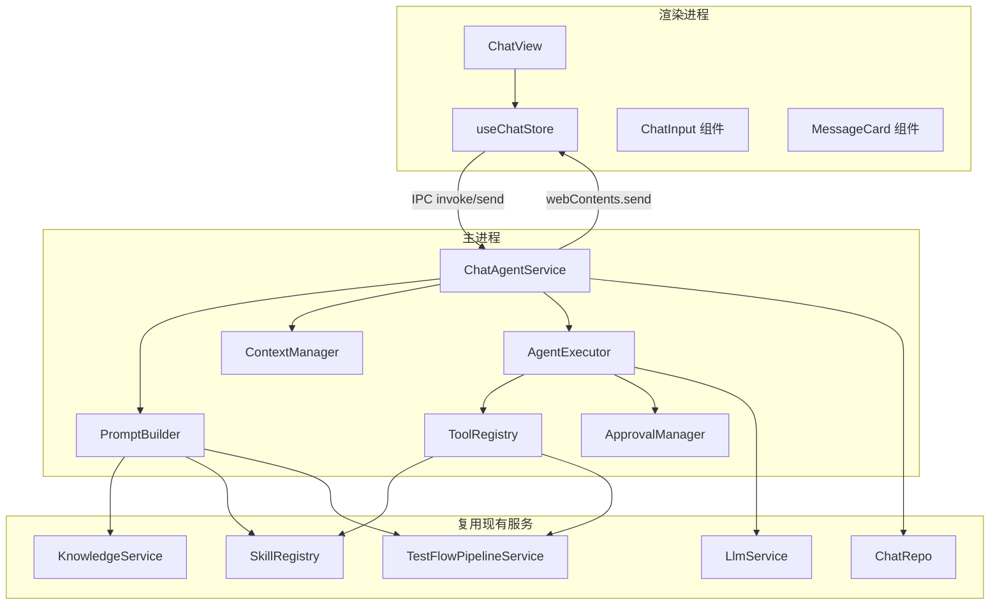

# AI 对话模块（Chat Agent）技术设计文档

## 修改历史

| 日期       | 版本  | 描述         | 作者     |
| ---------- | ----- | ------------ | -------- |
| 2026-05-25 | v1.0  | 初始版本     | CodeArts |

---

## 1. 实现模型

### 1.1 上下文视图

AI 对话模块位于 OmniTestAgent 的核心交互层，将用户自然语言输入转化为测试领域操作，通过 LLM 推理 + Function Calling 工具执行实现测试全流程对话式驱动。

```
┌─────────────────────────────────────────────────────────────────────┐
│                     渲染进程 (Renderer)                             │
│  ┌───────────┐  ┌──────────────┐  ┌─────────────────────────────┐  │
│  │ ChatView  │→│ useChatStore │→│ window.electronAPI.chatAgent │  │
│  │ (对话界面)│  │ (增强Store)  │  │ (IPC 桥接)                 │  │
│  └───────────┘  └──────────────┘  └──────────────┬──────────────┘  │
└────────────────────────────────────────────────────┼────────────────┘
                                                     │ IPC
┌────────────────────────────────────────────────────┼────────────────┐
│                     主进程 (Main)                   │                │
│  ┌─────────────────────────────────────────────────┴──────────────┐ │
│  │ ChatAgentService (Agent 执行循环)                              │ │
│  │  ┌─────────────┐ ┌─────────────┐ ┌────────────────────────┐  │ │
│  │  │PromptBuilder│ │ToolRegistry │ │ContextManager          │  │ │
│  │  │(8层注入)    │ │(9工具注册)  │ │(压缩/RAG/文件引用)    │  │ │
│  │  └─────────────┘ └─────────────┘ └────────────────────────┘  │ │
│  └────────────────────────────────────────────────────────────────┘ │
│  ┌────────────┐ ┌──────────────┐ ┌──────────────┐ ┌────────────┐ │
│  │ LlmService │ │KnowledgeSvc  │ │SkillRegistry │ │PipelineSvc │ │
│  │ (LLM调用)  │ │(RAG检索)     │ │(Skill管理)   │ │(流水线)    │ │
│  └────────────┘ └──────────────┘ └──────────────┘ └────────────┘ │
│  ┌────────────┐ ┌──────────────┐                                  │
│  │ ChatRepo   │ │SecureStore   │                                  │
│  │ (消息持久化)│ │(加密存储)    │                                  │
│  └────────────┘ └──────────────┘                                  │
└────────────────────────────────────────────────────────────────────┘
```

### 1.2 服务/组件总体架构



### 1.3 实现设计文档

#### 1.3.1 ChatAgentService — 主进程新增核心服务

**职责**：管理 Agent 执行循环，协调 PromptBuilder/ToolRegistry/ContextManager，通过 IPC 推送流式事件。

```typescript
// src/main/services/ChatAgentService.ts

export interface AgentChatParams {
  sessionId: string
  message: string
  projectId?: string
  knowledgeBaseId?: string
}

export interface AgentStreamEvent {
  type: 'thinking' | 'content' | 'tool_call' | 'tool_result' | 'done' | 'error'
  data: AgentStreamEventData
}

export class ChatAgentService {
  private promptBuilder: PromptBuilder
  private toolRegistry: ToolRegistry
  private contextManager: ContextManager
  private agentExecutor: AgentExecutor
  private abortControllers: Map<string, AbortController>

  async executeAgentLoop(params: AgentChatParams, win: BrowserWindow): Promise<void>
  abortSession(sessionId: string): void
}
```

#### 1.3.2 PromptBuilder — System Prompt 8层构建器

**职责**：按固定优先级顺序叠加8层内容，生成长度合规的 System Prompt。

```typescript
// src/main/services/chat/PromptBuilder.ts

export interface PromptLayer {
  name: string
  priority: number          // 1-8，越小优先级越高
  required: boolean         // true=不可裁剪
  build(context: PromptContext): Promise<string>
}

export interface PromptContext {
  projectId?: string
  knowledgeBaseId?: string
  userMessage: string
  pipelineState?: FlowPipelineState
  enabledSkills: ISkill[]
}

export class PromptBuilder {
  private layers: PromptLayer[]

  async build(context: PromptContext): Promise<string>
  async buildWithBudget(context: PromptContext, maxTokens: number): Promise<string>
}
```

#### 1.3.3 ToolRegistry — 测试领域工具注册表

**职责**：管理9个 Function Calling 工具的 Schema 定义和执行分发。

```typescript
// src/main/services/chat/ToolRegistry.ts

export interface ToolDefinition {
  name: string
  description: string
  parameters: Record<string, unknown>   // JSON Schema
  required: string[]
  approvalType: 'auto' | 'manual'
  handler: (args: Record<string, unknown>, context: ToolContext) => Promise<string>
}

export interface ToolContext {
  projectId: string
  sessionId: string
  win: BrowserWindow
}

export class ToolRegistry {
  private tools: Map<string, ToolDefinition>

  register(tool: ToolDefinition): void
  getSchema(): ToolSchema[]                  // 供 LLM Function Calling 使用
  execute(name: string, args: Record<string, unknown>, ctx: ToolContext): Promise<string>
  isAutoApproval(name: string): boolean
}
```

#### 1.3.4 ContextManager — 上下文管理与压缩

**职责**：管理对话历史、文件引用解析、上下文压缩和 Token 预算。

```typescript
// src/main/services/chat/ContextManager.ts

export interface ContextConfig {
  maxHistoryMessages: number     // 默认 40
  compressionThreshold: number   // 默认 0.7 (70%)
  maxFileReferences: number      // 默认 5
  maxFileContentLength: number   // 默认 10000
}

export class ContextManager {
  prepareMessages(sessionId: string, userMessage: string): Promise<ChatMessage[]>
  resolveFileReferences(message: string): Promise<{resolved: string; errors: string[]}>
  compressIfNeeded(messages: ChatMessage[], tokenBudget: number): Promise<ChatMessage[]>
  countTokens(messages: ChatMessage[]): number
}
```

#### 1.3.5 ApprovalManager — 工具审批管理

**职责**：管理人工审批流程，通过 IPC 向渲染进程请求用户确认。

```typescript
// src/main/services/chat/ApprovalManager.ts

export interface ApprovalRequest {
  toolName: string
  toolArgs: Record<string, unknown>
  sessionId: string
}

export interface ApprovalResult {
  approved: boolean
  reason?: string
}

export class ApprovalManager {
  async requestApproval(request: ApprovalRequest, win: BrowserWindow): Promise<ApprovalResult>
}
```

---

## 2. System Prompt 构建设计（8层注入）

### 2.1 层级定义与优先级

| 层级 | 名称       | 优先级 | 可裁剪 | 内容来源                               |
| ---- | ---------- | ------ | ------ | -------------------------------------- |
| 1    | 基础角色   | 1(最高)| 否     | 静态模板                               |
| 2    | 知识库上下文 | 2    | 是     | KnowledgeService.search() RAG 检索结果 |
| 3    | 项目上下文 | 3      | 是     | ProjectService 获取项目信息             |
| 4    | 可用工具   | 4      | 否     | ToolRegistry.getSchema()               |
| 5    | 行为指令   | 5      | 是     | 静态模板                               |
| 6    | 思考协议   | 6      | 是     | 静态模板                               |
| 7    | 流水线状态 | 7      | 是     | TestFlowPipelineService.getPipelineState() |
| 8    | 技能上下文 | 8(最低)| 是     | SkillRegistry 已启用 Skill 列表         |

### 2.2 各层具体内容

#### 层1：基础角色定义

```xml
<role>
You are OmniTestAgent, an intelligent testing expert with deep expertise in software testing methodology and practice.

## Core Competencies
- Test strategy design and optimization
- Test case design using: Equivalence Partitioning, Boundary Value Analysis, Orthogonal Experimental Design, Decision Table/Cause-Effect Graph, Scenario Method, Error Guessing
- Requirements analysis and testability assessment
- Defect root cause analysis and prevention
- Test automation and script generation
- Test pipeline orchestration and management

## Behavioral Guidelines
- Always reason step-by-step before providing answers
- Provide concrete, actionable recommendations
- Reference relevant testing theories when making decisions
- Proactively identify potential risks and edge cases
- Validate assumptions against available evidence
</role>
```

#### 层2：知识库上下文

```xml
<knowledge>
## Retrieved Knowledge Fragments
{{#each ragResults}}
### Source: {{source}} (Relevance: {{score}})
{{content}}
---
{{/each}}
</knowledge>
```

注入逻辑：
- 调用 `KnowledgeService.search(kbId, userMessage, 5)` 获取 Top-5 结果
- 若知识库检索失败，跳过该层注入，记录告警日志
- 若未关联知识库（`knowledgeBaseId` 为空），跳过该层

#### 层3：项目上下文

```xml
<project>
## Project Information
- Name: {{projectName}}
- Description: {{projectDescription}}

## Requirement Documents
{{#each requirementDocs}}
- {{fileName}} ({{fileSize}})
{{/each}}

## Spec Files
{{#each specFiles}}
- {{fileName}}
{{/each}}
</project>
```

#### 层4：可用工具

```xml
<tools>
## Available Tools
You have access to the following tools. Use them when the user's request matches a tool's capability.

{{#each toolSchemas}}
### {{name}}
{{description}}
Parameters: {{parameters}}
{{/each}}

## Tool Usage Guidelines
- Call only one tool at a time
- Wait for tool results before proceeding
- Summarize tool results for the user in plain language
- If a tool fails, explain the error and suggest alternatives
</tools>
```

#### 层5：行为指令

```xml
<behavior>
## Output Format
- Use Markdown formatting for all responses
- Use code blocks with language tags for code snippets
- Use tables for structured comparisons
- Use numbered lists for step-by-step procedures

## Interaction Norms
- Confirm understanding before taking action on ambiguous requests
- Report progress for long-running operations
- Ask for clarification rather than making assumptions
- Provide confidence levels when uncertain (high/medium/low)
</behavior>
```

#### 层6：思考协议

```xml
<thinking_protocol>
## Thinking Process Display
When solving complex problems, show your reasoning process:
1. **Understand**: Restate the problem and identify key constraints
2. **Analyze**: Break down the problem and consider approaches
3. **Decide**: Select the best approach with justification
4. **Execute**: Implement the chosen approach step by step
5. **Validate**: Check results against requirements

Use <thinking> tags for internal reasoning that users can optionally view.
</thinking_protocol>
```

#### 层7：流水线状态

```xml
<pipeline>
## Test Pipeline Status
{{#each steps}}
- {{label}}: {{status}} {{#if output}}(Output: {{outputSummary}}){{/if}}
{{/each}}

Overall Progress: {{overallProgress}}%
</pipeline>
```

#### 层8：技能上下文

```xml
<skills>
## Enabled Skills
{{#each enabledSkills}}
- **{{displayName}}**: {{description}}
{{/each}}

{{#if disabledSkills}}
## Disabled Skills (Not Available)
{{#each disabledSkills}}
- {{displayName}}: DISABLED
{{/each}}
{{/if}}
</skills>
```

### 2.3 叠加与长度控制算法

```
1. 按 priority 1→8 顺序依次调用各层 build()
2. 空层跳过（不插入空标签）
3. 层间使用 XML 分隔标签
4. 计算总 Token 数（通过 tiktoken 或估算 char/4）
5. 若超过上下文窗口 30%：
   a. 按优先级从低到高（8→2）尝试裁剪
   b. 裁剪策略：截断内容 > 摘要压缩 > 跳过该层
   c. 层1(基础角色)和层4(可用工具)标记 required=true，不可裁剪
6. 返回最终 System Prompt 字符串
```

---

## 3. Agent 执行循环设计

### 3.1 执行流程

```
用户消息
  │
  ▼
ContextManager.prepareMessages()  ─→ 解析文件引用 + 加载历史 + 压缩
  │
  ▼
PromptBuilder.build()  ─→ 8层注入构建 System Prompt
  │
  ▼
┌─────────────────────────────────────────────┐
│           Agent 执行循环 (Loop)              │
│                                              │
│  1. LlmService.streamChat(messages, tools)   │
│     │                                        │
│     ├─ yield thinking → IPC 推送             │
│     ├─ yield content  → IPC 推送             │
│     ├─ yield tool_call →                     │
│     │    │                                   │
│     │    ├─ ApprovalManager 检查审批策略      │
│     │    ├─ 人工审批 → IPC请求用户确认        │
│     │    ├─ ToolRegistry.execute()            │
│     │    ├─ yield tool_result → IPC 推送      │
│     │    └─ 结果回注 messages                 │
│     │                                        │
│     ├─ yield done → 退出循环                  │
│     └─ yield error → 错误处理                │
│                                              │
│  2. 若 LLM 返回 tool_call → 继续循环         │
│  3. 若 LLM 返回 finish_reason=stop → 退出    │
│  4. 若超过最大轮次(10) → 强制退出             │
└─────────────────────────────────────────────┘
  │
  ▼
持久化完整消息 + 更新 Token 统计
  │
  ▼
IPC 推送 done 事件
```

### 3.2 AgentExecutor 核心实现设计

```typescript
// src/main/services/chat/AgentExecutor.ts

const MAX_AGENT_ROUNDS = 10
const TOOL_TIMEOUT_MS = 60_000
const STREAM_TIMEOUT_MS = 30_000

export class AgentExecutor {
  constructor(
    private llmService: LlmService,
    private toolRegistry: ToolRegistry,
    private approvalManager: ApprovalManager,
    private chatRepo: ChatRepo
  ) {}

  async *execute(
    systemPrompt: string,
    messages: ChatMessage[],
    sessionId: string,
    projectId: string,
    win: BrowserWindow,
    abortSignal: AbortSignal
  ): AsyncGenerator<AgentStreamEvent> {
    let round = 0
    const conversationMessages = this.toLlmMessages(systemPrompt, messages)

    while (round < MAX_AGENT_ROUNDS) {
      round++
      const stream = await this.llmService.streamChatWithTools(
        conversationMessages,
        this.toolRegistry.getSchema(),
        abortSignal
      )

      let hasToolCall = false
      let contentBuffer = ''
      let thinkingBuffer = ''

      for await (const chunk of stream) {
        // 思考过程
        if (chunk.type === 'thinking') {
          thinkingBuffer += chunk.content
          yield { type: 'thinking', data: { content: chunk.content } }
        }
        // 内容文本
        if (chunk.type === 'content') {
          contentBuffer += chunk.content
          yield { type: 'content', data: { content: chunk.content } }
        }
        // 工具调用
        if (chunk.type === 'tool_call') {
          hasToolCall = true
          const toolCall = chunk.toolCall
          yield { type: 'tool_call', data: { name: toolCall.name, args: toolCall.args } }

          // 审批检查
          if (!this.toolRegistry.isAutoApproval(toolCall.name)) {
            const approval = await this.approvalManager.requestApproval(
              { toolName: toolCall.name, toolArgs: toolCall.args, sessionId }, win
            )
            if (!approval.approved) {
              yield { type: 'tool_result', data: { name: toolCall.name, result: `用户拒绝执行: ${approval.reason}`, status: 'rejected' } }
              conversationMessages.push(/* tool rejected message */)
              continue
            }
          }

          // 执行工具
          try {
            const result = await Promise.race([
              this.toolRegistry.execute(toolCall.name, toolCall.args, { projectId, sessionId, win }),
              this.timeout(TOOL_TIMEOUT_MS, `工具 ${toolCall.name} 执行超时`)
            ])
            const trimmedResult = this.trimResult(result)
            yield { type: 'tool_result', data: { name: toolCall.name, result: trimmedResult, status: 'success' } }
            conversationMessages.push(/* tool result message */)
          } catch (error: unknown) {
            const errorMsg = error instanceof Error ? error.message : String(error)
            yield { type: 'tool_result', data: { name: toolCall.name, result: errorMsg, status: 'failed' } }
            conversationMessages.push(/* tool error message */)
          }
        }
      }

      // 无工具调用则退出循环
      if (!hasToolCall) break
    }

    yield { type: 'done', data: { content: contentBuffer, rounds: round } }
  }
}
```

### 3.3 流式中断检测

使用 `AbortController` + 超时定时器实现：

```typescript
// 设置30秒超时检测
const timeoutHandle = setTimeout(() => {
  abortController.abort()
}, STREAM_TIMEOUT_MS)

// 每次 yield 重置超时
resetStreamTimeout()

// 用户主动中断
abortController.abort()
```

---

## 4. 工具注册与 Schema 设计

### 4.1 九个工具 JSON Schema 定义

#### 4.1.1 analyze_requirement — 需求分析

```json
{
  "name": "analyze_requirement",
  "description": "分析需求文档，提取测试点、功能模块和测试优先级。调用需求解析Skill执行分析。",
  "parameters": {
    "type": "object",
    "properties": {
      "focus_area": {
        "type": "string",
        "description": "分析关注区域，如'用户登录模块'、'支付流程'等"
      },
      "analysis_depth": {
        "type": "string",
        "enum": ["overview", "detailed", "comprehensive"],
        "description": "分析深度：概览/详细/全面，默认detailed"
      }
    }
  },
  "required": [],
  "approvalType": "manual"
}
```

#### 4.1.2 design_test — 测试设计

```json
{
  "name": "design_test",
  "description": "基于需求分析结果设计测试方案，包括测试策略、测试类型分配和测试环境要求。调用测试设计Skill执行。",
  "parameters": {
    "type": "object",
    "properties": {
      "test_types": {
        "type": "array",
        "items": { "type": "string" },
        "description": "指定测试类型，如['functional', 'performance', 'security']"
      },
      "priority_modules": {
        "type": "array",
        "items": { "type": "string" },
        "description": "优先测试的模块列表"
      }
    }
  },
  "required": [],
  "approvalType": "manual"
}
```

#### 4.1.3 generate_cases — 用例生成

```json
{
  "name": "generate_cases",
  "description": "基于测试设计方案生成测试用例，包含测试步骤、预期结果和优先级。调用用例生成Skill执行。",
  "parameters": {
    "type": "object",
    "properties": {
      "module_name": {
        "type": "string",
        "description": "指定生成用例的模块名称"
      },
      "case_format": {
        "type": "string",
        "enum": ["table", "gherkin", "markdown"],
        "description": "用例输出格式：表格/Gherkin/Markdown，默认markdown"
      }
    }
  },
  "required": [],
  "approvalType": "manual"
}
```

#### 4.1.4 generate_script — 脚本生成

```json
{
  "name": "generate_script",
  "description": "基于测试用例生成自动化测试脚本。调用脚本生成Skill执行，结果写入项目目录。",
  "parameters": {
    "type": "object",
    "properties": {
      "framework": {
        "type": "string",
        "enum": ["pytest", "selenium", "playwright", "jest", "unittest"],
        "description": "目标测试框架，默认pytest"
      },
      "target_cases": {
        "type": "array",
        "items": { "type": "string" },
        "description": "指定要生成脚本的用例ID列表"
      }
    }
  },
  "required": [],
  "approvalType": "manual"
}
```

#### 4.1.5 search_knowledge — 知识库检索

```json
{
  "name": "search_knowledge",
  "description": "在项目知识库中检索与查询相关的知识片段，用于补充测试领域知识和参考信息。",
  "parameters": {
    "type": "object",
    "properties": {
      "query": {
        "type": "string",
        "description": "检索查询文本"
      },
      "top_k": {
        "type": "integer",
        "minimum": 1,
        "maximum": 10,
        "description": "返回结果数量，默认5"
      }
    }
  },
  "required": ["query"],
  "approvalType": "auto"
}
```

#### 4.1.6 read_file — 文件读取

```json
{
  "name": "read_file",
  "description": "读取项目中指定文件的内容，如需求文档、Spec文件、测试用例等。",
  "parameters": {
    "type": "object",
    "properties": {
      "file_path": {
        "type": "string",
        "description": "相对于项目根目录的文件路径"
      },
      "encoding": {
        "type": "string",
        "enum": ["utf-8", "gbk"],
        "description": "文件编码，默认utf-8"
      }
    }
  },
  "required": ["file_path"],
  "approvalType": "auto"
}
```

#### 4.1.7 list_files — 文件列表

```json
{
  "name": "list_files",
  "description": "列出项目指定目录下的文件列表，用于了解项目结构和查找文件。",
  "parameters": {
    "type": "object",
    "properties": {
      "directory": {
        "type": "string",
        "description": "相对于项目根目录的目录路径，默认为根目录"
      },
      "pattern": {
        "type": "string",
        "description": "文件名匹配模式(glob)，如'*.md'、'**/*.py'"
      }
    }
  },
  "required": [],
  "approvalType": "auto"
}
```

#### 4.1.8 get_pipeline_status — 流水线状态

```json
{
  "name": "get_pipeline_status",
  "description": "获取当前项目测试流水线各环节的执行状态，包含各步骤完成情况和整体进度。",
  "parameters": {
    "type": "object",
    "properties": {}
  },
  "required": [],
  "approvalType": "auto"
}
```

#### 4.1.9 review_artifact — 审核产物

```json
{
  "name": "review_artifact",
  "description": "对流水线指定环节的产出进行审核，可批准或驳回并附修改意见。",
  "parameters": {
    "type": "object",
    "properties": {
      "step_type": {
        "type": "string",
        "enum": ["requirement_analysis", "test_design", "test_cases", "test_script"],
        "description": "要审核的流水线环节类型"
      },
      "result": {
        "type": "string",
        "enum": ["approved", "rejected"],
        "description": "审核结果：批准/驳回"
      },
      "comment": {
        "type": "string",
        "description": "审核意见或修改建议"
      }
    }
  },
  "required": ["step_type", "result"],
  "approvalType": "manual"
}
```

### 4.2 工具执行映射

| 工具名称              | 审批策略 | 执行映射                                             | 前置条件             |
| --------------------- | -------- | ---------------------------------------------------- | -------------------- |
| analyze_requirement   | manual   | `SkillEngine.execute('requirementParser', ctx)`       | 需求文档已导入       |
| design_test           | manual   | `SkillEngine.execute('testDesigner', ctx)`            | 需求分析已完成       |
| generate_cases        | manual   | `SkillEngine.execute('caseGenerator', ctx)`           | 测试设计已完成       |
| generate_script       | manual   | `SkillEngine.execute('scriptGenerator', ctx)`         | 用例设计已完成       |
| search_knowledge      | auto     | `KnowledgeService.search(kbId, query, topK)`          | 知识库已配置         |
| read_file             | auto     | `FileOperationService.readFile(projectId, path)`      | 文件存在             |
| list_files            | auto     | `FileOperationService.listFiles(projectId, dir)`      | 目录存在             |
| get_pipeline_status   | auto     | `TestFlowPipelineService.getPipelineState(projectId)` | 项目已关联           |
| review_artifact       | manual   | `TestFlowPipelineService.reviewStep(activityId, ...)`  | 环节有产出           |

### 4.3 工具输出裁剪规则

```
若工具返回结果 > 2000 字符:
  result = result.substring(0, 2000) + `[结果已裁剪，完整结果共 ${total} 字符]`
```

---

## 5. 流式事件处理设计

### 5.1 六种事件类型定义

```typescript
// src/main/services/chat/types.ts

export type StreamEventType = 'thinking' | 'content' | 'tool_call' | 'tool_result' | 'done' | 'error'

export interface ThinkingEvent {
  type: 'thinking'
  data: { content: string }
}

export interface ContentEvent {
  type: 'content'
  data: { content: string }
}

export interface ToolCallEvent {
  type: 'tool_call'
  data: {
    id: string
    name: string
    args: Record<string, unknown>
  }
}

export interface ToolResultEvent {
  type: 'tool_result'
  data: {
    id: string
    name: string
    result: string
    status: 'success' | 'failed' | 'rejected'
    executionTimeMs?: number
  }
}

export interface DoneEvent {
  type: 'done'
  data: {
    content: string
    rounds: number
    inputTokens: number
    outputTokens: number
  }
}

export interface ErrorEvent {
  type: 'error'
  data: {
    code: string
    message: string
    retryable: boolean
  }
}

export type AgentStreamEvent =
  | ThinkingEvent | ContentEvent | ToolCallEvent
  | ToolResultEvent | DoneEvent | ErrorEvent
```

### 5.2 主进程推送流程

```typescript
// ChatAgentService.executeAgentLoop() 中
async *executeAgentLoop(...): AsyncGenerator<AgentStreamEvent> {
  for await (const event of this.agentExecutor.execute(...)) {
    // 通过 BrowserWindow.webContents.send 推送到渲染进程
    win.webContents.send('chatAgent:streamEvent', {
      sessionId: params.sessionId,
      event
    })
    yield event
  }
}
```

### 5.3 渲染进程处理流程

```
IPC 事件 chatAgent:streamEvent
  │
  ▼
useChatStore.onStreamEvent(event)
  │
  ├─ thinking → 追加到 currentAssistantMessage.thinkingContent
  ├─ content  → 追加到 currentAssistantMessage.content
  ├─ tool_call → 追加到 currentAssistantMessage.toolCalls[]
  ├─ tool_result → 更新 toolCalls[i].result
  ├─ done → 标记消息完成 + 触发持久化 + 更新 Token 统计
  └─ error → 标记消息失败 + 显示错误提示
```

---

## 6. 主进程新增 Service 设计

### 6.1 ChatAgentService

```
文件路径: src/main/services/ChatAgentService.ts

依赖:
  - PromptBuilder
  - ToolRegistry
  - ContextManager
  - AgentExecutor
  - ApprovalManager
  - ChatRepo
  - LlmService
  - KnowledgeService
  - SkillRegistry
  - TestFlowPipelineService

公开方法:
  - executeAgentLoop(params, win): Promise<void>    — 执行Agent循环
  - abortSession(sessionId): void                   — 中断会话执行
  - isExecuting(sessionId): boolean                 — 查询执行状态

生命周期:
  - 实例化时初始化 PromptBuilder/ToolRegistry/ContextManager/AgentExecutor
  - 每次 executeAgentLoop 创建独立 AbortController
  - 应用退出时清理所有 AbortController
```

### 6.2 文件结构

```
src/main/services/
├── ChatAgentService.ts           # Agent 服务入口
└── chat/                         # Chat Agent 子模块
    ├── PromptBuilder.ts          # System Prompt 8层构建
    ├── PromptLayers.ts           # 8层具体实现
    ├── ToolRegistry.ts           # 工具注册表
    ├── ToolHandlers.ts           # 工具执行处理器
    ├── ToolSchemas.ts            # 工具 JSON Schema 定义
    ├── ContextManager.ts         # 上下文管理与压缩
    ├── AgentExecutor.ts          # Agent 执行循环
    ├── ApprovalManager.ts        # 审批管理
    ├── SlashCommandParser.ts     # 斜杠命令解析
    └── types.ts                  # 类型定义
```

---

## 7. IPC 接口设计

### 7.1 IPC 通道定义

| 通道                          | 方向   | 参数                                   | 返回值          | 描述               |
| ----------------------------- | ------ | -------------------------------------- | --------------- | ------------------ |
| `chatAgent:sendMessage`       | R→M    | `{sessionId, message, projectId?}`     | `void`          | 发送消息触发Agent   |
| `chatAgent:abort`             | R→M    | `{sessionId}`                          | `void`          | 中断当前Agent执行   |
| `chatAgent:streamEvent`       | M→R    | `AgentStreamEvent`                     | —               | 流式事件推送        |
| `chatAgent:approvalRequest`   | M→R    | `ApprovalRequest`                      | —               | 审批请求推送        |
| `chatAgent:approvalResponse`  | R→M    | `{requestId, approved, reason?}`       | `void`          | 审批响应            |
| `chat:createSession`          | R→M    | `{projectId?, title?}`                 | `ChatSession`   | 创建会话            |
| `chat:listSessions`           | R→M    | `{projectId?}`                         | `ChatSession[]` | 列出会话            |
| `chat:deleteSession`          | R→M    | `{sessionId}`                          | `boolean`       | 删除会话            |
| `chat:renameSession`          | R→M    | `{sessionId, title}`                   | `boolean`       | 重命名会话          |
| `chat:getMessages`            | R→M    | `{sessionId}`                          | `ChatMessage[]` | 获取消息历史        |
| `chat:resolveFileRef`         | R→M    | `{projectId, filePath}`                | `{content, error?}` | 解析文件引用   |
| `chat:getSlashCommands`       | R→M    | `{projectId}`                          | `SlashCommand[]`| 获取可用斜杠命令    |

### 7.2 IPC Handler 注册

```typescript
// src/main/ipc/chatAgentHandler.ts

export function registerChatAgentHandlers(): void {
  ipcMain.handle('chatAgent:sendMessage', async (event, params) => {
    const win = BrowserWindow.fromWebContents(event.sender)
    if (!win) throw new Error('Window not found')
    return chatAgentService.executeAgentLoop(params, win)
  })

  ipcMain.handle('chatAgent:abort', async (_event, params) => {
    chatAgentService.abortSession(params.sessionId)
  })

  ipcMain.handle('chatAgent:approvalResponse', async (_event, params) => {
    approvalManager.resolveApproval(params.requestId, params.approved, params.reason)
  })

  // ... 其他 handler
}
```

### 7.3 Preload 桥接

```typescript
// src/preload/index.ts 新增 chatAgent 命名空间
contextBridge.exposeInMainWorld('electronAPI', {
  // ... 现有命名空间
  chatAgent: {
    sendMessage: (params) => ipcRenderer.invoke('chatAgent:sendMessage', params),
    abort: (params) => ipcRenderer.invoke('chatAgent:abort', params),
    onStreamEvent: (callback) => ipcRenderer.on('chatAgent:streamEvent', callback),
    removeStreamListener: () => ipcRenderer.removeAllListeners('chatAgent:streamEvent'),
    onApprovalRequest: (callback) => ipcRenderer.on('chatAgent:approvalRequest', callback),
    removeApprovalListener: () => ipcRenderer.removeAllListeners('chatAgent:approvalRequest'),
    approvalResponse: (params) => ipcRenderer.invoke('chatAgent:approvalResponse', params),
  },
  chat: {
    createSession: (params) => ipcRenderer.invoke('chat:createSession', params),
    listSessions: (params) => ipcRenderer.invoke('chat:listSessions', params),
    deleteSession: (params) => ipcRenderer.invoke('chat:deleteSession', params),
    renameSession: (params) => ipcRenderer.invoke('chat:renameSession', params),
    getMessages: (params) => ipcRenderer.invoke('chat:getMessages', params),
    resolveFileRef: (params) => ipcRenderer.invoke('chat:resolveFileRef', params),
    getSlashCommands: (params) => ipcRenderer.invoke('chat:getSlashCommands', params),
  }
})
```

---

## 8. 渲染进程设计

### 8.1 Store 重构 — useChatStore 增强

```typescript
// src/renderer/store/useChatStore.ts

export const useChatStore = defineStore('chat', () => {
  // === 会话管理 ===
  const sessions = ref<ChatSession[]>([])
  const currentSessionId = ref<string | null>(null)
  const messages = ref<ChatMessage[]>([])

  // === 流式状态 ===
  const streaming = ref(false)
  const currentAssistantMessage = ref<AssistantMessage | null>(null)

  // === 审批状态 ===
  const pendingApproval = ref<ApprovalRequest | null>(null)

  // === Agent 执行状态 ===
  const agentState = ref<'idle' | 'thinking' | 'generating' | 'tool_calling' | 'done' | 'error'>('idle')

  // === Token 统计 ===
  const tokenUsage = ref({ inputTokens: 0, outputTokens: 0 })

  // --- 核心方法 ---
  async function sendMessage(content: string): Promise<void> {
    // 1. 解析斜杠命令
    const parsed = SlashCommandParser.parse(content)
    if (parsed.isCommand) {
      return executeSlashCommand(parsed)
    }

    // 2. 解析文件引用
    const { resolvedMessage } = await resolveFileReferences(content)

    // 3. 添加用户消息到列表
    addUserMessage(resolvedMessage)

    // 4. 触发 Agent 执行
    streaming.value = true
    agentState.value = 'thinking'
    currentAssistantMessage.value = createEmptyAssistantMessage()

    // 5. 注册流式事件监听
    registerStreamListeners()

    // 6. IPC 调用
    try {
      await window.electronAPI.chatAgent.sendMessage({
        sessionId: currentSessionId.value,
        message: resolvedMessage,
        projectId: currentProjectId.value
      })
    } catch (error: unknown) {
      handleSendError(error)
    }
  }

  function onStreamEvent(event: AgentStreamEvent): void {
    switch (event.type) {
      case 'thinking':
        currentAssistantMessage.value!.thinkingContent += event.data.content
        agentState.value = 'thinking'
        break
      case 'content':
        currentAssistantMessage.value!.content += event.data.content
        agentState.value = 'generating'
        break
      case 'tool_call':
        currentAssistantMessage.value!.toolCalls.push({
          id: event.data.id,
          name: event.data.name,
          args: event.data.args,
          status: 'pending',
          result: null
        })
        agentState.value = 'tool_calling'
        break
      case 'tool_result':
        updateToolCallResult(event.data)
        break
      case 'done':
        finalizeMessage(event.data)
        agentState.value = 'done'
        streaming.value = false
        break
      case 'error':
        handleError(event.data)
        agentState.value = 'error'
        streaming.value = false
        break
    }
  }

  function abortExecution(): void {
    window.electronAPI.chatAgent.abort({ sessionId: currentSessionId.value! })
  }

  // --- 审批方法 ---
  async function respondApproval(approved: boolean, reason?: string): Promise<void> {
    if (!pendingApproval.value) return
    await window.electronAPI.chatAgent.approvalResponse({
      requestId: pendingApproval.value.requestId,
      approved,
      reason
    })
    pendingApproval.value = null
  }

  // ... 其他方法

  return {
    sessions, currentSessionId, messages, streaming,
    currentAssistantMessage, pendingApproval, agentState, tokenUsage,
    sendMessage, abortExecution, respondApproval,
    onStreamEvent,
    // ... 其他
  }
})
```

### 8.2 消息数据类型增强

```typescript
// src/renderer/types/chat.ts

export interface AssistantMessage {
  id: string
  sessionId: string
  role: 'assistant'
  content: string                       // 内容文本（Markdown）
  thinkingContent: string               // 思考过程
  toolCalls: ToolCallInfo[]             // 工具调用列表
  isFailed: boolean
  isPartial: boolean                    // 是否部分完成（中断）
  inputTokens: number
  outputTokens: number
  createdAt: string
}

export interface ToolCallInfo {
  id: string
  name: string
  args: Record<string, unknown>
  result: string | null
  status: 'pending' | 'running' | 'success' | 'failed' | 'rejected'
  executionTimeMs?: number
}

export interface ChatMessage {
  id: string
  sessionId: string
  role: 'user' | 'assistant' | 'system' | 'tool'
  content: string
  metadata?: MessageMetadata
  isFailed: boolean
  createdAt: string
}

export interface MessageMetadata {
  thinkingContent?: string
  toolCalls?: ToolCallInfo[]
  inputTokens?: number
  outputTokens?: number
}
```

### 8.3 ChatView 组件结构

```
src/renderer/features/chat/
├── views/
│   └── ChatView.vue              # 主视图（布局：会话列表 + 对话区 + 输入区）
├── components/
│   ├── ChatInput.vue             # 输入框（斜杠命令补全 + 文件引用）
│   ├── MessageList.vue           # 消息列表（虚拟滚动）
│   ├── MessageCard.vue           # 单条消息卡片
│   ├── ThinkingBlock.vue         # 思考过程（可折叠）
│   ├── ToolCallBlock.vue         # 工具调用展示
│   ├── ToolResultBlock.vue       # 工具结果（可折叠）
│   ├── MarkdownContent.vue       # Markdown 渲染内容
│   ├── ApprovalDialog.vue        # 工具审批确认对话框
│   ├── SlashCommandMenu.vue      # 斜杠命令弹出菜单
│   ├── FileRefPopup.vue          # 文件引用选择弹窗
│   └── SessionSidebar.vue        # 会话侧边栏列表
└── composables/
    ├── useSlashCommand.ts        # 斜杠命令逻辑
    └── useFileReference.ts       # 文件引用逻辑
```

### 8.4 思考过程 + 工具调用展示设计

**MessageCard 渲染结构**：

```
┌─────────────────────────────────────────┐
│ 💭 思考过程 ▸                            │  ← 可折叠，默认折叠
│ ┌─────────────────────────────────────┐ │
│ │ 1. 首先需要理解用户的需求...          │ │
│ │ 2. 分析现有流水线状态...             │ │
│ │ 3. 决定使用 analyze_requirement...  │ │
│ └─────────────────────────────────────┘ │
│                                          │
│ 📝 AI 回复内容（Markdown 渲染）          │
│ 基于您的需求，我建议先进行需求分析...     │
│                                          │
│ 🔧 工具调用:                             │
│ ┌─ analyze_requirement ────────────────┐ │
│ │ 参数: { focus_area: "用户登录" }     │ │
│ │ 状态: ✅ 成功 (耗时 3.2s)            │ │
│ │ 结果 ▸                               │ │  ← 可折叠
│ │ ┌──────────────────────────────────┐ │ │
│ │ │ 识别到3个核心功能模块...           │ │ │
│ │ └──────────────────────────────────┘ │ │
│ └──────────────────────────────────────┘ │
│                                          │
│ 14:32                                    │  ← 时间戳
└─────────────────────────────────────────┘
```

**ThinkingBlock 组件**：

```vue
<!-- ThinkingBlock.vue -->
<template>
  <div class="thinking-block" v-if="content">
    <div class="thinking-header" @click="expanded = !expanded">
      <IconBrain />
      <span>思考过程</span>
      <IconArrow :class="{ rotated: expanded }" />
    </div>
    <div class="thinking-content" v-show="expanded">
      <MarkdownContent :content="content" />
    </div>
  </div>
</template>
```

**ToolCallBlock 组件**：

```vue
<!-- ToolCallBlock.vue -->
<template>
  <div class="tool-call-block">
    <div class="tool-header">
      <IconWrench />
      <span class="tool-name">{{ toolCall.name }}</span>
      <StatusIcon :status="toolCall.status" />
      <span v-if="toolCall.executionTimeMs" class="exec-time">
        ({{ (toolCall.executionTimeMs / 1000).toFixed(1) }}s)
      </span>
    </div>
    <div class="tool-args">
      <code>{{ JSON.stringify(toolCall.args, null, 2) }}</code>
    </div>
    <ToolResultBlock
      v-if="toolCall.result"
      :result="toolCall.result"
      :status="toolCall.status"
    />
  </div>
</template>
```

### 8.5 斜杠命令设计

#### 命令定义

```typescript
// src/renderer/features/chat/composables/useSlashCommand.ts

export interface SlashCommand {
  command: string          // '/analyze'
  label: string            // '需求分析'
  description: string      // '分析需求文档，提取测试点'
  icon: string             // 'icon-search'
  mappedTool: string       // 'analyze_requirement'
  requiresSkill: string    // 'requirementParser'
  prerequisite?: string    // '需求文档已导入'
}

export const SLASH_COMMANDS: SlashCommand[] = [
  {
    command: '/analyze',
    label: '需求分析',
    description: '分析需求文档，提取测试点',
    icon: 'icon-search',
    mappedTool: 'analyze_requirement',
    requiresSkill: 'requirementParser',
    prerequisite: '需求文档已导入'
  },
  {
    command: '/design',
    label: '测试设计',
    description: '设计测试方案和策略',
    icon: 'icon-design',
    mappedTool: 'design_test',
    requiresSkill: 'testDesigner',
    prerequisite: '需求分析已完成'
  },
  {
    command: '/cases',
    label: '用例生成',
    description: '生成测试用例',
    icon: 'icon-file-text',
    mappedTool: 'generate_cases',
    requiresSkill: 'caseGenerator',
    prerequisite: '测试设计已完成'
  },
  {
    command: '/script',
    label: '脚本生成',
    description: '生成自动化测试脚本',
    icon: 'icon-code',
    mappedTool: 'generate_script',
    requiresSkill: 'scriptGenerator',
    prerequisite: '用例设计已完成'
  }
]
```

#### 命令解析与执行

```typescript
// src/main/services/chat/SlashCommandParser.ts

export interface ParsedCommand {
  isCommand: boolean
  command?: string
  args?: string
  remainingText?: string
}

export class SlashCommandParser {
  static parse(input: string): ParsedCommand {
    const trimmed = input.trim()
    // 匹配 /command [args] 模式
    const match = trimmed.match(/^\/(\w+)\s*(.*)/)
    if (!match) return { isCommand: false }

    const [, command, args] = match
    const knownCommands = ['analyze', 'design', 'cases', 'script']

    if (!knownCommands.includes(command)) {
      return { isCommand: false }  // 未知命令，作为普通消息处理
    }

    return {
      isCommand: true,
      command: `/${command}`,
      args: args.trim() || undefined,
      remainingText: args.trim() || undefined
    }
  }

  static toToolCall(parsed: ParsedCommand): { toolName: string; toolArgs: Record<string, unknown> } | null {
    if (!parsed.isCommand || !parsed.command) return null

    const commandToolMap: Record<string, string> = {
      '/analyze': 'analyze_requirement',
      '/design': 'design_test',
      '/cases': 'generate_cases',
      '/script': 'generate_script'
    }

    return {
      toolName: commandToolMap[parsed.command],
      toolArgs: parsed.args ? { focus_area: parsed.args } : {}
    }
  }
}
```

#### ChatInput 中斜杠命令交互

```vue
<!-- ChatInput.vue 关键交互逻辑 -->
<template>
  <div class="chat-input">
    <a-textarea
      v-model="inputText"
      @input="onInputChange"
      @keydown.enter="onEnter"
      placeholder="输入消息，/ 触发命令，@ 引用文件..."
    />
    <SlashCommandMenu
      v-if="showCommandMenu"
      :filter="commandFilter"
      :commands="availableCommands"
      @select="onCommandSelect"
    />
    <FileRefPopup
      v-if="showFilePopup"
      @select="onFileSelect"
    />
    <a-button @click="send" :disabled="!canSend">
      <IconSend />
    </a-button>
  </div>
</template>
```

### 8.6 文件引用设计

#### 引用语法

- 输入 `@` 触发文件选择弹窗
- 选择后插入 `@文件名` 到输入框
- 发送前解析所有 `@文件名`，读取文件内容注入消息

#### 引用解析流程

```
用户消息: "请分析 @需求规格说明书.md 这个文档"
  │
  ▼
正则匹配: /@([^\s@]+)/g → ["需求规格说明书.md"]
  │
  ▼
IPC: chat:resolveFileRef({ projectId, filePath: "需求规格说明书.md" })
  │
  ▼
主进程: FileOperationService.readFile(projectId, filePath)
  │
  ▼
注入格式:
[引用文件: 需求规格说明书.md]
{{fileContent}}
[/引用文件]

请分析这个文档
```

#### 约束规则

| 约束               | 限制值  | 超限处理               |
| ------------------ | ------- | ---------------------- |
| 单次文件引用数     | 5       | 提示"引用文件过多"     |
| 单文件内容长度     | 10000字符 | 截断 + 标注          |
| 文件不存在         | —       | 跳过 + 标注引用失败   |

---

## 9. 上下文管理与压缩策略

### 9.1 上下文预算分配

```
LLM 上下文窗口 (例: 128K tokens)
├── System Prompt: ≤ 30% (38.4K)
├── 对话历史:     ≤ 50% (64K)
├── 当前用户消息:  ≤ 10% (12.8K)
└── 预留缓冲:      10% (12.8K)
```

### 9.2 对话历史管理

```
历史消息上限: 40 条 (FIFO 淘汰)
压缩触发阈值: Token 数达到上下文窗口 70%
压缩策略: 对最早 10 条消息进行摘要压缩
```

### 9.3 压缩算法

```
1. 检查当前 messages 总 Token 数
2. 若未超阈值 → 直接返回
3. 若超阈值:
   a. 取最早 10 条消息
   b. 调用 LlmService.chat() 生成摘要:
      prompt: "请对以下对话历史进行摘要，保留关键结论、决策和工具调用结果："
      input: 10条消息拼接
   c. 将10条消息替换为1条 system 角色的摘要消息:
      { role: 'system', content: '[对话摘要] {summary}' }
   d. 压缩失败降级: 直接删除最早10条消息
4. 重复检查，直到 Token 数低于阈值
```

### 9.4 RAG 检索注入策略

```
触发时机: 每次对话请求前
检索范围: 当前会话关联的知识库
检索参数:
  - query: 用户最新消息
  - topK: 5
  - minScore: 0.6 (相似度阈值)
注入位置: System Prompt 层2
```

---

## 10. 审批策略设计

### 10.1 审批分类

| 类别     | 工具                                       | 策略   | 交互                           |
| -------- | ------------------------------------------ | ------ | ------------------------------ |
| 只读操作 | search_knowledge, read_file, list_files, get_pipeline_status | 自动审批 | 无需用户确认，直接执行 |
| 写操作   | analyze_requirement, design_test, generate_cases, generate_script, review_artifact | 人工审批 | 弹出确认对话框，等待用户确认 |

### 10.2 人工审批交互流程

```
Agent 执行循环遇到需人工审批的 tool_call
  │
  ▼
主进程 → 渲染进程: chatAgent:approvalRequest 推送
  {
    requestId: "approval-xxx",
    toolName: "generate_script",
    toolArgs: { framework: "pytest" },
    riskLevel: "medium",    // low/medium/high
    description: "即将生成pytest测试脚本并写入项目目录"
  }
  │
  ▼
渲染进程弹出 ApprovalDialog:
  ┌─────────────────────────────────────────┐
  │ ⚠️ 工具执行确认                          │
  │                                          │
  │ 即将执行: generate_script                │
  │ 风险等级: 🟡 中等                        │
  │ 说明: 即将生成pytest测试脚本并写入项目目录│
  │                                          │
  │ 参数:                                    │
  │   framework: "pytest"                    │
  │                                          │
  │      [取消]    [确认执行]                 │
  └─────────────────────────────────────────┘
  │
  ▼
用户点击 → 渲染进程 → 主进程: chatAgent:approvalResponse
  { requestId: "approval-xxx", approved: true/false }
  │
  ▼
主进程继续/中止工具执行
```

### 10.3 审批超时处理

- 审批等待超时：60秒
- 超时后默认拒绝，回注 LLM "用户未响应审批请求"

---

## 11. 错误处理设计

### 11.1 错误分类与处理矩阵

| 错误类型             | 错误码            | 处理策略                                   | 用户感知                     |
| -------------------- | ----------------- | ------------------------------------------ | ---------------------------- |
| LLM 未配置           | `LLM_NOT_CONFIGURED` | 禁用发送按钮 + 引导提示                   | "请先在 LLM 配置中配置服务"  |
| LLM 连接失败         | `LLM_CONNECTION_FAILED` | 自动重试3次(2s/4s/8s退避) → 标记失败    | "LLM 服务连接失败" + 重试按钮 |
| LLM 返回空响应       | `LLM_EMPTY_RESPONSE`  | 标记失败 + 提示重新提问                   | "AI 未返回有效内容"          |
| Token 超限           | `LLM_TOKEN_LIMIT`     | 触发上下文压缩 → 重试请求                | 自动处理，用户无感知         |
| 流式中断(SSE断开)    | `STREAM_INTERRUPTED`  | 保留部分内容 + 标记部分完成               | "响应中断，已保留部分内容"   |
| 流式超时(30s无Token) | `STREAM_TIMEOUT`      | AbortController.abort() + 保留部分内容    | "响应超时，已保留部分内容"   |
| 工具执行失败         | `TOOL_EXECUTION_FAILED` | 错误信息回注 LLM → LLM 决策重试/换方式  | 展示失败信息，AI可能给替代方案 |
| 工具参数缺失         | `TOOL_PARAM_MISSING`  | 参数错误回注 LLM → 请求补充参数          | AI自动补充或追问             |
| 工具执行超时(60s)    | `TOOL_EXECUTION_TIMEOUT` | 终止工具 + 超时错误回注 LLM             | 展示超时信息                 |
| 用户拒绝审批         | `TOOL_APPROVAL_REJECTED` | 拒绝信息回注 LLM → 调整回答策略         | AI调整回答                   |
| 审批超时(60s)        | `APPROVAL_TIMEOUT`    | 默认拒绝 + 回注 LLM                      | "审批超时，已取消"           |
| 文件引用不存在       | `FILE_REF_NOT_FOUND`  | 跳过该引用 + 标注失败                     | "引用文件 xxx 不存在"        |
| 文件引用过大         | `FILE_REF_TOO_LARGE`  | 截断前10000字符 + 标注截断                | "文件内容过长，已截取"       |
| 知识库检索失败       | `RAG_SEARCH_FAILED`   | 跳过层2注入 + 告警日志                    | 对话继续，缺乏知识增强       |
| System Prompt 超长   | `SYSTEM_PROMT_OVERFLOW` | 按优先级裁剪低优先层                     | 对话继续，部分上下文裁剪     |
| 数据库写入失败       | `DB_WRITE_FAILED`     | 内存保留 + 定时重试持久化                 | 对话继续，不中断交互         |
| 禁用Skill工具调用    | `SKILL_DISABLED`       | 从工具列表移除 → LLM不可调用             | 该工具不可用                 |

### 11.2 重试策略

```typescript
// 网络错误重试: 指数退避
const RETRY_CONFIG = {
  maxRetries: 3,
  baseDelay: 2000,     // 2s
  maxDelay: 8000,      // 8s
  backoffFactor: 2     // 2s → 4s → 8s
}

async function retryWithBackoff<T>(
  fn: () => Promise<T>,
  config: typeof RETRY_CONFIG
): Promise<T> {
  for (let attempt = 0; attempt <= config.maxRetries; attempt++) {
    try {
      return await fn()
    } catch (error: unknown) {
      if (attempt === config.maxRetries) throw error
      const delay = Math.min(
        config.baseDelay * Math.pow(config.backoffFactor, attempt),
        config.maxDelay
      )
      await sleep(delay)
    }
  }
  throw new Error('Retry exhausted')
}
```

### 11.3 错误日志记录

```typescript
// 所有错误记录格式
interface ErrorLog {
  timestamp: string
  errorType: string        // 错误分类
  errorCode: string        // 错误码
  message: string          // 可读错误消息
  sessionId?: string       // 关联会话
  toolName?: string        // 关联工具
  stackSummary?: string    // 堆栈摘要(前3行)
  retryAttempt?: number    // 重试次数
}
```

---

## 12. 数据模型

### 12.1 设计目标

- 扩展现有 `chat_session` 和 `chat_message` 表以支持 Agent 对话特性
- 新增字段支持工具调用元数据、Token 统计和消息状态标记
- 保持向后兼容，现有数据不受影响

### 12.2 模型实现

#### ChatSession 表扩展

```sql
-- chat_session 表新增字段 (ALTER TABLE)
ALTER TABLE chat_session ADD COLUMN total_input_tokens INTEGER NOT NULL DEFAULT 0;
ALTER TABLE chat_session ADD COLUMN total_output_tokens INTEGER NOT NULL DEFAULT 0;
ALTER TABLE chat_session ADD COLUMN request_count INTEGER NOT NULL DEFAULT 0;
```

```typescript
export interface ChatSession {
  id: string
  project_id: string | null
  title: string                    // 最大100字符
  total_input_tokens: number       // 累计输入Token
  total_output_tokens: number      // 累计输出Token
  request_count: number            // 累计请求次数
  created_at: string
  updated_at: string
}
```

#### ChatMessage 表扩展

```sql
-- chat_message 表新增字段 (ALTER TABLE)
ALTER TABLE chat_message ADD COLUMN metadata TEXT;               -- JSON: 工具调用/思考过程
ALTER TABLE chat_message ADD COLUMN is_failed INTEGER NOT NULL DEFAULT 0;  -- 0/1
```

```typescript
export interface ChatMessage {
  id: string
  session_id: string
  role: 'user' | 'assistant' | 'system' | 'tool'
  content: string                  // 消息正文
  token_count: number
  metadata: MessageMetadata | null // JSON: 工具调用等扩展信息
  is_failed: 0 | 1                 // 消息失败标记
  created_at: string
}

export interface MessageMetadata {
  thinkingContent?: string         // 思考过程内容
  toolCalls?: ToolCallMetadata[]   // 工具调用列表
  isPartial?: boolean              // 是否部分完成
  inputTokens?: number
  outputTokens?: number
}

export interface ToolCallMetadata {
  id: string
  name: string
  args: Record<string, unknown>
  result: string
  status: 'pending' | 'running' | 'success' | 'failed' | 'rejected'
  executionTimeMs: number
}
```

### 12.3 迁移脚本

```typescript
// src/main/data/migrations/002_chat_agent.ts

export function up(db: DbAdapter): void {
  db.run('ALTER TABLE chat_session ADD COLUMN total_input_tokens INTEGER NOT NULL DEFAULT 0')
  db.run('ALTER TABLE chat_session ADD COLUMN total_output_tokens INTEGER NOT NULL DEFAULT 0')
  db.run('ALTER TABLE chat_session ADD COLUMN request_count INTEGER NOT NULL DEFAULT 0')
  db.run('ALTER TABLE chat_message ADD COLUMN metadata TEXT')
  db.run('ALTER TABLE chat_message ADD COLUMN is_failed INTEGER NOT NULL DEFAULT 0')
}
```

---

## 13. 接口设计

### 13.1 总体设计

遵循项目分层架构约束：**IPC层 → Service层 → Repository层 → Database层**，严格单向依赖。

```
渲染进程                     主进程
────────                     ─────
ChatView                     chatAgentHandler (IPC层)
  → useChatStore               → ChatAgentService (Service层)
    → window.electronAPI          → PromptBuilder
      .chatAgent.sendMessage()    → ToolRegistry
      .chatAgent.abort()          → ContextManager
      .chat.*()                   → AgentExecutor
                                   → ApprovalManager
                                   → ChatRepo (Repository层)
                                   → LlmService (复用)
                                   → KnowledgeService (复用)
                                   → SkillRegistry (复用)
                                   → TestFlowPipelineService (复用)
```

### 13.2 接口清单

#### 主进程 Service 接口

| 接口                                        | 描述                         |
| ------------------------------------------- | ---------------------------- |
| `ChatAgentService.executeAgentLoop()`       | 执行 Agent 对话循环          |
| `ChatAgentService.abortSession()`           | 中断会话执行                 |
| `PromptBuilder.build()`                     | 构建 System Prompt           |
| `ToolRegistry.register()`                   | 注册工具                     |
| `ToolRegistry.getSchema()`                  | 获取工具 Schema 列表         |
| `ToolRegistry.execute()`                    | 执行工具                     |
| `ContextManager.prepareMessages()`          | 准备上下文消息               |
| `ContextManager.resolveFileReferences()`    | 解析文件引用                 |
| `ContextManager.compressIfNeeded()`         | 条件压缩                     |
| `AgentExecutor.execute()`                   | Agent 执行循环（AsyncGenerator） |
| `ApprovalManager.requestApproval()`         | 请求人工审批                 |
| `SlashCommandParser.parse()`                | 解析斜杠命令                 |

#### 渲染进程 Store 接口

| 接口                           | 描述                         |
| ------------------------------ | ---------------------------- |
| `useChatStore.sendMessage()`   | 发送消息                     |
| `useChatStore.abortExecution()`| 中断执行                     |
| `useChatStore.respondApproval()`| 响应审批                   |
| `useChatStore.onStreamEvent()` | 处理流式事件                 |
| `useChatStore.createSession()` | 创建会话                     |
| `useChatStore.deleteSession()` | 删除会话                     |

#### IPC 接口

见第7节 IPC 接口设计完整清单。
