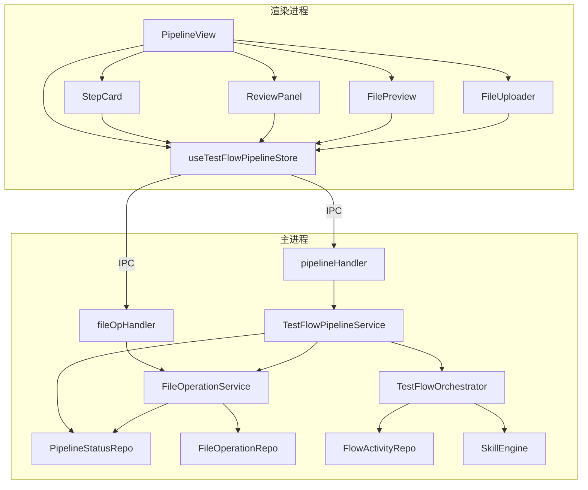

# 测试设计流水线模块技术设计

## 修改历史

| 日期       | 版本  | 描述         | 作者      |
| ---------- | ----- | ------------ | --------- |
| 2026-05-24 | v1.0  | 初始版本     | CodeArts  |

---

# 1. 实现模型

## 1.1 上下文视图

测试设计流水线模块在 OmniTestAgent 整体架构中的位置及与外部系统的交互关系：

```
┌─────────────────────────────────────────────────────────────────────┐
│                    Electron BrowserWindow                          │
│  ┌───────────────────────────────────────────────────────────────┐  │
│  │                   渲染进程                                    │  │
│  │  ┌─────────────┐  ┌──────────────────┐  ┌────────────────┐  │  │
│  │  │ PipelineView │→│TestFlowPipeline  │→│ window.        │  │  │
│  │  │ StepCard     │  │ Store            │  │ electronAPI   │  │  │
│  │  │ ReviewPanel │  │                  │  │   .testflow    │  │  │
│  │  │ FilePreview │  │                  │  │   .fileOp      │  │  │
│  │  │ FileUploader│  │                  │  │   .pipeline    │  │  │
│  │  └─────────────┘  └──────────────────┘  └───────┬────────┘  │  │
│  └────────────────────────────────────────────────┼─────────────┘  │
│                                                    │ IPC          │
│  ┌────────────────────────────────────────────────┼─────────────┐  │
│  │                Preload 桥接层                   │             │  │
│  │  contextBridge.exposeInMainWorld('electronAPI')│             │  │
│  └────────────────────────────────────────────────┼─────────────┘  │
│                                                    │              │
│  ┌────────────────────────────────────────────────┼─────────────┐  │
│  │                  主进程                         │             │  │
│  │  ┌──────────┐  ┌──────────────────┐  ┌────────┴──────────┐  │  │
│  │  │ IPC 层   │→│  Service 层       │→│  Repository 层     │  │  │
│  │  │ pipeline │  │ TestFlowPipeline │  │ PipelineStatus    │  │  │
│  │  │ fileOp   │  │ FileOperation    │  │ FileOperation     │  │  │
│  │  │ testflow │  │ TestFlowOrchestr │  │ FlowActivity      │  │  │
│  │  └──────────┘  └──────┬───────────┘  └───────────────────┘  │  │
│  │                       │                                      │  │
│  │  ┌──────────┐  ┌──────┴───────────┐  ┌──────────────────┐  │  │
│  │  │ Skills   │  │  文件系统 (FS)    │  │  LLM Service     │  │  │
│  │  │ (4内置)  │  │  .test_design_   │  │  (流式调用)       │  │  │
│  │  │          │  │  status.md       │  │                   │  │  │
│  │  └──────────┘  └──────────────────┘  └──────────────────┘  │  │
│  └────────────────────────────────────────────────────────────────┘  │
└─────────────────────────────────────────────────────────────────────┘
```

### 外部依赖

| 依赖系统      | 交互方式                       | 用途                                |
| ------------- | ------------------------------ | ----------------------------------- |
| LLM 服务      | ISkill → LlmService（流式）    | 需求分析/测试设计/用例生成/脚本生成  |
| 文件系统      | fileHelper + fs                | 目录管理、文件读写、状态持久化        |
| sql.js        | FlowActivityRepo + PipelineStatusRepo | 活动状态与审核记录持久化       |

---

## 1.2 服务/组件总体架构

### 1.2.1 主进程新增模块

```
src/main/
├── ipc/
│   ├── pipelineHandler.ts          ← 新增：流水线IPC handler
│   └── fileOpHandler.ts            ← 新增：文件操作IPC handler
├── services/
│   ├── TestFlowPipelineService.ts  ← 新增：流水线编排与状态机
│   └── FileOperationService.ts     ← 新增：文件读写操作
└── data/repositories/
    ├── PipelineStatusRepo.ts       ← 新增：.test_design_status.md 读写
    └── FileOperationRepo.ts        ← 新增：项目目录文件操作
```

### 1.2.2 渲染进程新增/变更模块

```
src/renderer/
├── features/testflow/
│   ├── views/
│   │   └── PipelineView.vue        ← 重构：流水线可视化主视图
│   └── components/
│       ├── StepCard.vue             ← 新增：环节卡片组件
│       ├── ReviewPanel.vue          ← 新增：审核面板组件
│       ├── FilePreview.vue          ← 新增：文件预览组件
│       └── FileUploader.vue         ← 新增：文件上传组件
├── store/
│   └── useTestFlowPipelineStore.ts ← 新增：流水线Pipeline Store
└── types/
    └── testflow-pipeline.ts         ← 新增：流水线类型定义
```

### 1.2.3 模块依赖关系



---

## 1.3 实现设计文档

### 1.3.1 数据模型设计

#### 流水线环节类型枚举

```typescript
/** 流水线环节类型 - 按规格9环节定义（含spec_import） */
export enum PipelineStepType {
  REQUIREMENT_IMPORT = 'requirement_import',
  SPEC_IMPORT = 'spec_import',
  REQUIREMENT_ANALYSIS = 'requirement_analysis',
  REQUIREMENT_REVIEW = 'requirement_review',
  TEST_DESIGN = 'test_design',
  DESIGN_REVIEW = 'design_review',
  CASE_GENERATION = 'case_generation',
  CASE_REVIEW = 'case_review',
  SCRIPT_GENERATION = 'script_generation'
}

/** 环节状态枚举 */
export enum StepStatus {
  IDLE = 'idle',           // U - 未就绪/未完成
  RUNNING = 'running',     // 执行中
  COMPLETED = 'completed', // √ - 已完成
  FAILED = 'failed'        // 失败
}

/** 审核结果枚举 */
export enum ReviewResult {
  APPROVED = 'approved',
  REJECTED = 'rejected'
}
```

#### 前置依赖配置

```typescript
/** 前置依赖规则：定义每个执行环节的前置依赖集合 */
export const STEP_DEPENDENCIES: Record<PipelineStepType, PipelineStepType[]> = {
  [PipelineStepType.REQUIREMENT_IMPORT]: [],            // 无依赖
  [PipelineStepType.SPEC_IMPORT]: [],                    // 无依赖
  [PipelineStepType.REQUIREMENT_ANALYSIS]: [PipelineStepType.REQUIREMENT_IMPORT],
  [PipelineStepType.REQUIREMENT_REVIEW]: [PipelineStepType.REQUIREMENT_ANALYSIS],
  [PipelineStepType.TEST_DESIGN]: [PipelineStepType.SPEC_IMPORT],
  [PipelineStepType.DESIGN_REVIEW]: [PipelineStepType.TEST_DESIGN],
  [PipelineStepType.CASE_GENERATION]: [PipelineStepType.TEST_DESIGN],
  [PipelineStepType.CASE_REVIEW]: [PipelineStepType.CASE_GENERATION],
  [PipelineStepType.SCRIPT_GENERATION]: [PipelineStepType.CASE_GENERATION]
}

/** 审核环节到被审核环节的映射 */
export const REVIEW_TO_STEP_MAP: Record<PipelineStepType, PipelineStepType> = {
  [PipelineStepType.REQUIREMENT_REVIEW]: PipelineStepType.REQUIREMENT_ANALYSIS,
  [PipelineStepType.DESIGN_REVIEW]: PipelineStepType.TEST_DESIGN,
  [PipelineStepType.CASE_REVIEW]: PipelineStepType.CASE_GENERATION
}

/** 审核退回时的级联恢复范围：退回某环节时，该环节及所有下游环节恢复为idle */
export const CASCADE_DOWNSTREAM: Record<PipelineStepType, PipelineStepType[]> = {
  [PipelineStepType.REQUIREMENT_ANALYSIS]: [
    PipelineStepType.REQUIREMENT_ANALYSIS,
    PipelineStepType.REQUIREMENT_REVIEW,
    PipelineStepType.TEST_DESIGN,
    PipelineStepType.DESIGN_REVIEW,
    PipelineStepType.CASE_GENERATION,
    PipelineStepType.CASE_REVIEW,
    PipelineStepType.SCRIPT_GENERATION
  ],
  [PipelineStepType.TEST_DESIGN]: [
    PipelineStepType.TEST_DESIGN,
    PipelineStepType.DESIGN_REVIEW,
    PipelineStepType.CASE_GENERATION,
    PipelineStepType.CASE_REVIEW,
    PipelineStepType.SCRIPT_GENERATION
  ],
  [PipelineStepType.CASE_GENERATION]: [
    PipelineStepType.CASE_GENERATION,
    PipelineStepType.CASE_REVIEW,
    PipelineStepType.SCRIPT_GENERATION
  ]
}
```

#### 环节元数据

```typescript
/** 环节元数据配置 */
export interface StepMeta {
  type: PipelineStepType
  label: string
  description: string
  isReview: boolean
  isImport: boolean
  outputDir: string          // 对应输出目录名
  skillName: string | null   // 对应的Skill名称
  icon: string               // Arco Design 图标名
}

export const STEP_META_MAP: Record<PipelineStepType, StepMeta> = {
  [PipelineStepType.REQUIREMENT_IMPORT]: {
    type: PipelineStepType.REQUIREMENT_IMPORT,
    label: '需求导入', description: '上传需求文档到项目目录',
    isReview: false, isImport: true, outputDir: '01_requirement',
    skillName: null, icon: 'icon-upload'
  },
  [PipelineStepType.SPEC_IMPORT]: {
    type: PipelineStepType.SPEC_IMPORT,
    label: 'Spec导入', description: '上传特性规格文档到项目目录',
    isReview: false, isImport: true, outputDir: '02_spec',
    skillName: null, icon: 'icon-upload'
  },
  [PipelineStepType.REQUIREMENT_ANALYSIS]: {
    type: PipelineStepType.REQUIREMENT_ANALYSIS,
    label: '测试需求分析', description: '基于需求文档进行测试需求分析',
    isReview: false, isImport: false, outputDir: '03_requirement_analyze',
    skillName: 'requirementParser', icon: 'icon-thunder'
  },
  [PipelineStepType.REQUIREMENT_REVIEW]: {
    type: PipelineStepType.REQUIREMENT_REVIEW,
    label: '需求分析审核', description: '审核测试需求分析结果',
    isReview: true, isImport: false, outputDir: '03_requirement_analyze',
    skillName: null, icon: 'icon-check-circle'
  },
  [PipelineStepType.TEST_DESIGN]: {
    type: PipelineStepType.TEST_DESIGN,
    label: '测试设计', description: '基于Spec与需求分析进行测试设计',
    isReview: false, isImport: false, outputDir: '04_test_design',
    skillName: 'testDesigner', icon: 'icon-thunder'
  },
  [PipelineStepType.DESIGN_REVIEW]: {
    type: PipelineStepType.DESIGN_REVIEW,
    label: '设计审核', description: '审核测试设计方案',
    isReview: true, isImport: false, outputDir: '04_test_design',
    skillName: null, icon: 'icon-check-circle'
  },
  [PipelineStepType.CASE_GENERATION]: {
    type: PipelineStepType.CASE_GENERATION,
    label: '测试用例设计', description: '基于测试设计生成测试用例',
    isReview: false, isImport: false, outputDir: '05_test_cases',
    skillName: 'caseGenerator', icon: 'icon-thunder'
  },
  [PipelineStepType.CASE_REVIEW]: {
    type: PipelineStepType.CASE_REVIEW,
    label: '用例审核', description: '审核测试用例设计结果',
    isReview: true, isImport: false, outputDir: '05_test_cases',
    skillName: null, icon: 'icon-check-circle'
  },
  [PipelineStepType.SCRIPT_GENERATION]: {
    type: PipelineStepType.SCRIPT_GENERATION,
    label: '测试脚本生成', description: '基于测试用例生成自动化脚本',
    isReview: false, isImport: false, outputDir: '06_test_scripts',
    skillName: 'scriptGenerator', icon: 'icon-thunder'
  }
}
```

#### 流水线状态聚合模型

```typescript
/** 流水线环节状态（渲染进程使用） */
export interface PipelineStepState {
  type: PipelineStepType
  status: StepStatus
  updatedAt: string
  retryCount: number           // 连续重试次数
  errorMessage: string | null  // 失败时的错误信息
  progress: number             // 0-100 进度百分比
  streamingContent: string     // 流式输出的当前内容
}

/** 流水线整体状态 */
export interface FlowPipelineState {
  projectId: string
  steps: PipelineStepState[]
  overallProgress: number      // 整体进展百分比
  lastUpdatedAt: string
}

/** 文件信息 */
export interface FileInfo {
  name: string
  path: string
  size: number
  modifiedAt: string
  isDirectory: boolean
}

/** 审核记录 */
export interface ReviewRecord {
  id: string
  activityType: PipelineStepType
  round: number                // 审核轮次 v1, v2, ...
  result: ReviewResult
  content: string              // 修改后的内容
  comment: string | null
  reviewer: string | null
  reviewedAt: string
}

/** 进度推送事件 */
export interface PipelineProgressEvent {
  activityType: PipelineStepType
  status: StepStatus
  progress: number
  streamingContent?: string
  output?: unknown
  error?: string
}
```

#### 项目目录结构定义

```typescript
/** 测试设计项目标准目录定义 */
export const PROJECT_DIRS = [
  '01_requirement',
  '02_spec',
  '03_requirement_analyze',
  '04_test_design',
  '05_test_cases',
  '06_test_scripts',
  '07_test_review'
] as const

/** 状态文件名 */
export const STATUS_FILE_NAME = '.test_design_status.md'

/** 项目目录与环节的映射 */
export const DIR_TO_STEP_MAP: Record<string, PipelineStepType> = {
  '01_requirement': PipelineStepType.REQUIREMENT_IMPORT,
  '02_spec': PipelineStepType.SPEC_IMPORT,
  '03_requirement_analyze': PipelineStepType.REQUIREMENT_ANALYSIS,
  '04_test_design': PipelineStepType.TEST_DESIGN,
  '05_test_cases': PipelineStepType.CASE_GENERATION,
  '06_test_scripts': PipelineStepType.SCRIPT_GENERATION
}
```

---

### 1.3.2 主进程新增模块设计

#### TestFlowPipelineService

**职责**：流水线编排核心，管理状态机、前置依赖校验、级联状态恢复、状态持久化。扩展现有 `TestFlowOrchestrator` 的能力。

```typescript
// src/main/services/TestFlowPipelineService.ts

export class TestFlowPipelineService {
  /**
   * 获取流水线完整状态（聚合数据库状态 + 目录检测 + 状态文件）
   * 优先级：目录实际文件状态 > 状态文件 > 数据库
   */
  getPipelineState(projectId: string): FlowPipelineState

  /**
   * 执行流水线环节
   * 1. 校验前置依赖
   * 2. 校验执行互斥（running/completed不可重复触发）
   * 3. 更新状态为running
   * 4. 调用Skill或执行导入
   * 5. 推送进度事件
   * 6. 完成后更新状态并持久化
   */
  executeStep(
    projectId: string,
    stepType: PipelineStepType,
    win: BrowserWindow
  ): Promise<void>

  /**
   * 中断正在执行的环节
   */
  interruptStep(activityId: string): void

  /**
   * 审核操作
   * - approved: 更新审核状态为completed，归档修改内容
   * - rejected: 级联恢复该环节及下游为idle
   */
  reviewStep(
    activityId: string,
    result: ReviewResult,
    modifiedContent: string,
    comment?: string,
    reviewer?: string
  ): void

  /**
   * 重试失败的环节
   * 校验重试次数（≤3），超限提示检查LLM配置
   */
  retryStep(
    projectId: string,
    stepType: PipelineStepType,
    win: BrowserWindow
  ): Promise<void>

  /**
   * 应用重启恢复：将所有running状态重置为idle
   */
  recoverOnStartup(projectId: string): void

  /**
   * 从目录文件实际状态重新推算流水线状态（状态文件损坏时）
   */
  rebuildStateFromDirs(projectId: string): FlowPipelineState

  /**
   * 校验前置依赖是否全部满足
   */
  private checkDependencies(
    projectId: string,
    stepType: PipelineStepType
  ): boolean

  /**
   * 审核退回时级联恢复下游状态
   */
  private cascadeResetDownstream(
    projectId: string,
    stepType: PipelineStepType
  ): void

  /**
   * 持久化状态到 .test_design_status.md
   */
  private persistState(projectId: string, state: FlowPipelineState): void
}

export const testFlowPipelineService = new TestFlowPipelineService()
```

**依赖关系**：
- `TestFlowOrchestrator` — 复用已有的execute/interrupt/review逻辑
- `PipelineStatusRepo` — 状态文件读写
- `FileOperationService` — 目录检测与文件操作
- `FlowActivityRepo` — 数据库活动状态
- `SkillEngine` — Skill执行引擎

#### FileOperationService

**职责**：封装测试设计项目的文件操作，包括目录初始化、文件上传、文件读取、文件列表、文件预览内容获取。

```typescript
// src/main/services/FileOperationService.ts

export class FileOperationService {
  /**
   * 初始化测试设计项目目录结构
   * 创建8个标准目录 + 1个状态文件（初始状态）
   */
  initProjectDirs(projectId: string): void

  /**
   * 获取项目目录的绝对根路径
   */
  getProjectDir(projectId: string): string

  /**
   * 上传文件到指定目录
   * 校验格式和大小，复制文件到目标目录
   */
  uploadFiles(
    projectId: string,
    targetDir: string,
    filePaths: string[]
  ): Promise<FileInfo[]>

  /**
   * 列出指定目录下的文件
   */
  listFiles(projectId: string, dirName: string): FileInfo[]

  /**
   * 读取文件内容（用于预览）
   * 返回文件内容和类型标记（markdown/code/binary）
   */
  readFileContent(
    projectId: string,
    dirName: string,
    fileName: string
  ): { content: string; fileType: 'markdown' | 'code' | 'binary' | 'text' }

  /**
   * 写入文件（审核归档时回写）
   */
  writeFile(
    projectId: string,
    dirName: string,
    fileName: string,
    content: string
  ): void

  /**
   * 检测目录是否有有效文件（用于导入状态自动检测）
   */
  hasFiles(projectId: string, dirName: string): boolean

  /**
   * 打开文件选择对话框（返回选择文件路径列表）
   */
  showOpenDialog(options: Electron.OpenDialogOptions): Promise<string[] | undefined>

  /**
   * 校验上传文件（格式 + 大小）
   */
  private validateUploadFile(
    fileName: string,
    fileSize: number
  ): { valid: boolean; error?: string }
}

export const fileOperationService = new FileOperationService()
```

#### PipelineStatusRepo

**职责**：`.test_design_status.md` 状态文件的读写与解析。

```typescript
// src/main/data/repositories/PipelineStatusRepo.ts

export class PipelineStatusRepo {
  /**
   * 读取状态文件，解析为 FlowPipelineState
   * 文件不存在或损坏时返回 null
   */
  read(projectId: string): FlowPipelineState | null

  /**
   * 写入状态文件（序列化为Markdown格式）
   */
  write(projectId: string, state: FlowPipelineState): void

  /**
   * 初始化状态文件（所有环节为idle）
   */
  init(projectId: string): void

  /**
   * 检查状态文件是否存在
   */
  exists(projectId: string): boolean

  /**
   * 将 FlowPipelineState 序列化为 Markdown 文本
   */
  private serializeToMarkdown(state: FlowPipelineState): string

  /**
   * 将 Markdown 文本解析为 FlowPipelineState
   * 解析失败时返回 null
   */
  private parseFromMarkdown(
    projectId: string,
    content: string
  ): FlowPipelineState | null
}

export const pipelineStatusRepo = new PipelineStatusRepo()
```

#### FileOperationRepo

**职责**：文件系统底层操作封装，与 `fileHelper` 集成。

```typescript
// src/main/data/repositories/FileOperationRepo.ts

export class FileOperationRepo {
  /** 获取测试设计项目根路径 */
  getTestDesignDir(projectId: string): string

  /** 确保目录存在 */
  ensureDir(dirPath: string): void

  /** 列出目录下文件 */
  listFiles(dirPath: string): FileInfo[]

  /** 读取文件文本内容 */
  readTextFile(filePath: string): string

  /** 写入文件 */
  writeTextFile(filePath: string, content: string): void

  /** 复制文件到目标目录 */
  copyFile(srcPath: string, destDir: string): FileInfo

  /** 检查目录是否有文件 */
  hasFiles(dirPath: string): boolean

  /** 删除文件 */
  deleteFile(filePath: string): void
}

export const fileOperationRepo = new FileOperationRepo()
```

---

### 1.3.3 IPC 接口设计

#### 新增 IPC Channel

| Channel                     | 方向     | 参数                                             | 返回值                     | 说明                     |
| --------------------------- | -------- | ------------------------------------------------ | -------------------------- | ------------------------ |
| `pipeline:getState`         | R → M    | `projectId: string`                              | `FlowPipelineState`        | 获取流水线完整状态       |
| `pipeline:executeStep`      | R → M    | `{ projectId, stepType }`                        | `void`                    | 执行流水线环节           |
| `pipeline:interruptStep`    | R → M    | `activityId: string`                             | `void`                    | 中断环节执行             |
| `pipeline:reviewStep`       | R → M    | `{ activityId, result, modifiedContent, comment?, reviewer? }` | `void`          | 审核操作（通过/退回）    |
| `pipeline:retryStep`        | R → M    | `{ projectId, stepType }`                        | `void`                    | 重试失败环节             |
| `pipeline:progress`         | M → R    | `PipelineProgressEvent`                          | —                         | 进度推送（主→渲染）      |
| `fileOp:initProjectDirs`    | R → M    | `projectId: string`                              | `void`                    | 初始化项目目录结构       |
| `fileOp:uploadFiles`        | R → M    | `{ projectId, targetDir, filePaths[] }`          | `FileInfo[]`              | 上传文件到目标目录       |
| `fileOp:listFiles`          | R → M    | `{ projectId, dirName }`                         | `FileInfo[]`              | 列出目录文件             |
| `fileOp:readFileContent`    | R → M    | `{ projectId, dirName, fileName }`               | `{ content, fileType }`   | 读取文件内容             |
| `fileOp:writeFile`          | R → M    | `{ projectId, dirName, fileName, content }`      | `void`                    | 写入文件                 |
| `fileOp:hasFiles`           | R → M    | `{ projectId, dirName }`                         | `boolean`                 | 检测目录是否有文件       |
| `fileOp:showOpenDialog`     | R → M    | `OpenDialogOptions`                              | `string[] \| undefined`   | 打开文件选择对话框       |

#### IPC Handler 实现

```typescript
// src/main/ipc/pipelineHandler.ts
import { BrowserWindow } from 'electron'
import { registerIpcHandler } from './helpers'
import { testFlowPipelineService } from '../services/TestFlowPipelineService'

export function registerPipelineHandler(): void {
  registerIpcHandler('pipeline:getState', (projectId: string) =>
    testFlowPipelineService.getPipelineState(projectId))

  registerIpcHandler('pipeline:executeStep',
    (params: { projectId: string; stepType: PipelineStepType }) => {
      const win = BrowserWindow.getFocusedWindow()
      if (!win) throw new Error('No focused window available')
      return testFlowPipelineService.executeStep(params.projectId, params.stepType, win)
    })

  registerIpcHandler('pipeline:interruptStep', (activityId: string) =>
    testFlowPipelineService.interruptStep(activityId))

  registerIpcHandler('pipeline:reviewStep',
    (params: { activityId: string; result: ReviewResult; modifiedContent: string; comment?: string; reviewer?: string }) =>
      testFlowPipelineService.reviewStep(
        params.activityId, params.result, params.modifiedContent, params.comment, params.reviewer))

  registerIpcHandler('pipeline:retryStep',
    (params: { projectId: string; stepType: PipelineStepType }) => {
      const win = BrowserWindow.getFocusedWindow()
      if (!win) throw new Error('No focused window available')
      return testFlowPipelineService.retryStep(params.projectId, params.stepType, win)
    })
}
```

```typescript
// src/main/ipc/fileOpHandler.ts
import { registerIpcHandler } from './helpers'
import { fileOperationService } from '../services/FileOperationService'

export function registerFileOpHandler(): void {
  registerIpcHandler('fileOp:initProjectDirs', (projectId: string) =>
    fileOperationService.initProjectDirs(projectId))

  registerIpcHandler('fileOp:uploadFiles',
    (params: { projectId: string; targetDir: string; filePaths: string[] }) =>
      fileOperationService.uploadFiles(params.projectId, params.targetDir, params.filePaths))

  registerIpcHandler('fileOp:listFiles',
    (params: { projectId: string; dirName: string }) =>
      fileOperationService.listFiles(params.projectId, params.dirName))

  registerIpcHandler('fileOp:readFileContent',
    (params: { projectId: string; dirName: string; fileName: string }) =>
      fileOperationService.readFileContent(params.projectId, params.dirName, params.fileName))

  registerIpcHandler('fileOp:writeFile',
    (params: { projectId: string; dirName: string; fileName: string; content: string }) =>
      fileOperationService.writeFile(params.projectId, params.dirName, params.fileName, params.content))

  registerIpcHandler('fileOp:hasFiles',
    (params: { projectId: string; dirName: string }) =>
      fileOperationService.hasFiles(params.projectId, params.dirName))

  registerIpcHandler('fileOp:showOpenDialog',
    (options: Electron.OpenDialogOptions) =>
      fileOperationService.showOpenDialog(options))
}
```

#### Preload 桥接扩展

在 `src/preload/index.ts` 的 `electronAPI` 中新增 `pipeline` 和 `fileOp` 命名空间：

```typescript
pipeline: {
  getState: (projectId: string) =>
    ipcRenderer.invoke('pipeline:getState', projectId),
  executeStep: (params: { projectId: string; stepType: string }) =>
    ipcRenderer.invoke('pipeline:executeStep', params),
  interruptStep: (activityId: string) =>
    ipcRenderer.invoke('pipeline:interruptStep', activityId),
  reviewStep: (params: {
    activityId: string; result: string;
    modifiedContent: string; comment?: string; reviewer?: string
  }) => ipcRenderer.invoke('pipeline:reviewStep', params),
  retryStep: (params: { projectId: string; stepType: string }) =>
    ipcRenderer.invoke('pipeline:retryStep', params),
  onProgress: (callback: (event: unknown, progress: PipelineProgressEvent) => void) =>
    ipcRenderer.on('pipeline:progress', callback),
  removeProgressListeners: () =>
    ipcRenderer.removeAllListeners('pipeline:progress')
},
fileOp: {
  initProjectDirs: (projectId: string) =>
    ipcRenderer.invoke('fileOp:initProjectDirs', projectId),
  uploadFiles: (params: { projectId: string; targetDir: string; filePaths: string[] }) =>
    ipcRenderer.invoke('fileOp:uploadFiles', params),
  listFiles: (params: { projectId: string; dirName: string }) =>
    ipcRenderer.invoke('fileOp:listFiles', params),
  readFileContent: (params: { projectId: string; dirName: string; fileName: string }) =>
    ipcRenderer.invoke('fileOp:readFileContent', params),
  writeFile: (params: { projectId: string; dirName: string; fileName: string; content: string }) =>
    ipcRenderer.invoke('fileOp:writeFile', params),
  hasFiles: (params: { projectId: string; dirName: string }) =>
    ipcRenderer.invoke('fileOp:hasFiles', params),
  showOpenDialog: (options: Electron.OpenDialogOptions) =>
    ipcRenderer.invoke('fileOp:showOpenDialog', options)
}
```

---

### 1.3.4 渲染进程设计

#### Store 设计：useTestFlowPipelineStore

```typescript
// src/renderer/store/useTestFlowPipelineStore.ts

export const useTestFlowPipelineStore = defineStore('testFlowPipeline', () => {
  // === State ===
  const pipelineState = ref<FlowPipelineState | null>(null)
  const selectedStepType = ref<PipelineStepType | null>(null)
  const currentFiles = ref<FileInfo[]>([])
  const previewContent = ref<{ content: string; fileType: string } | null>(null)
  const reviewContent = ref<string>('')       // 审核编辑区的当前内容
  const reviewRecords = ref<ReviewRecord[]>([])
  const loading = ref(false)
  const uploading = ref(false)

  // === Getters ===
  /** 获取指定环节状态 */
  const getStepState = computed(() =>
    (type: PipelineStepType): PipelineStepState | undefined =>
      pipelineState.value?.steps.find(s => s.type === type))

  /** 判断环节是否可执行（依赖满足且非running/completed） */
  const canExecute = computed(() =>
    (type: PipelineStepType): boolean => {
      const step = getStepState.value(type)
      if (!step) return false
      if (step.status === StepStatus.RUNNING || step.status === StepStatus.COMPLETED) return false
      const deps = STEP_DEPENDENCIES[type]
      return deps.every(dep => {
        const depStep = getStepState.value(dep)
        return depStep?.status === StepStatus.COMPLETED
      })
    })

  /** 判断环节是否可重试 */
  const canRetry = computed(() =>
    (type: PipelineStepType): boolean => {
      const step = getStepState.value(type)
      return step?.status === StepStatus.FAILED && step.retryCount < 3
    })

  /** 当前选中的环节状态 */
  const selectedStep = computed(() =>
    selectedStepType.value
      ? getStepState.value(selectedStepType.value)
      : undefined)

  // === Actions ===
  /** 获取流水线完整状态 */
  async function fetchPipelineState(projectId: string): Promise<void>

  /** 执行环节 */
  async function executeStep(projectId: string, stepType: PipelineStepType): Promise<void>

  /** 中断环节 */
  async function interruptStep(activityId: string): Promise<void>

  /** 审核操作 */
  async function reviewStep(
    activityId: string,
    result: ReviewResult,
    modifiedContent: string,
    comment?: string
  ): Promise<void>

  /** 重试环节 */
  async function retryStep(projectId: string, stepType: PipelineStepType): Promise<void>

  /** 列出目录文件 */
  async function fetchFiles(projectId: string, dirName: string): Promise<void>

  /** 读取文件预览内容 */
  async function fetchFileContent(
    projectId: string,
    dirName: string,
    fileName: string
  ): Promise<void>

  /** 上传文件 */
  async function uploadFiles(
    projectId: string,
    targetDir: string,
    filePaths: string[]
  ): Promise<void>

  /** 打开文件选择对话框并上传 */
  async function openAndUpload(
    projectId: string,
    targetDir: string
  ): Promise<void>

  /** 监听进度推送 */
  function setupProgressListener(): void

  /** 清理进度监听器 */
  function cleanupProgressListener(): void

  return {
    // state
    pipelineState, selectedStepType, currentFiles, previewContent,
    reviewContent, reviewRecords, loading, uploading,
    // getters
    getStepState, canExecute, canRetry, selectedStep,
    // actions
    fetchPipelineState, executeStep, interruptStep, reviewStep, retryStep,
    fetchFiles, fetchFileContent, uploadFiles, openAndUpload,
    setupProgressListener, cleanupProgressListener
  }
})
```

#### 组件设计

##### PipelineView.vue — 流水线可视化主视图

**设计风格**：参考 GitHub Actions 流水线卡片风格，横向流水线布局，环节卡片通过连线箭头展示依赖关系。

```
┌─────────────────────────────────────────────────────────────────────────────┐
│  测试设计流水线                                              项目：xxx     │
├─────────────────────────────────────────────────────────────────────────────┤
│                                                                             │
│  ┌──────────┐     ┌──────────────────┐     ┌──────────┐                    │
│  │ 需求导入  │ ──→ │ 测试需求分析     │ ──→ │ 需求审核  │                   │
│  │    √     │     │      √          │     │    U     │                   │
│  └──────────┘     └──────────────────┘     └──────────┘                   │
│                                                                             │
│  ┌──────────┐     ┌──────────────────┐     ┌──────────┐                    │
│  │ Spec导入  │ ──→ │ 测试设计         │ ──→ │ 设计审核  │                   │
│  │    U     │     │    (disabled)    │     │(disabled)│                   │
│  └──────────┘     └──────────────────┘     └──────────┘                   │
│                                   │                                        │
│                                   ↓                                        │
│  ┌──────────────────┐     ┌──────────┐     ┌──────────────────┐           │
│  │ 测试用例设计      │ ──→ │ 用例审核  │ ──→ │ 测试脚本生成      │          │
│  │    (disabled)    │     │(disabled)│     │    (disabled)    │           │
│  └──────────────────┘     └──────────┘     └──────────────────┘           │
│                                                                             │
├─────────────────────────────────────────────────────────────────────────────┤
│  文件列表区域                    │  文件预览 / 审核面板区域                    │
│  ┌─────────────────────┐       │  ┌─────────────────────────────────────┐  │
│  │ 03_requirement_analyze│       │  │ (Markdown渲染 / 代码高亮 / 审核编辑) │  │
│  │  ├── analysis.md     │       │  │                                     │  │
│  │  └── summary.md      │       │  │                                     │  │
│  └─────────────────────┘       │  └─────────────────────────────────────┘  │
└─────────────────────────────────────────────────────────────────────────────┘
```

**组件接口**：

```vue
<!-- PipelineView.vue -->
<script setup lang="ts">
// Props
interface Props {
  projectId: string
}
const props = defineProps<Props>()

// 布局结构
// - 顶部：流水线卡片区域（双行布局，上行：需求线，下行：Spec线→设计线→脚本线）
// - 中部：文件列表（左侧）+ 文件预览/审核面板（右侧）
// - 依赖：StepCard, ReviewPanel, FilePreview, FileUploader, FileList
</script>
```

**流水线卡片布局逻辑**：
- **上行（需求分析线）**：需求导入 → 测试需求分析 → 需求分析审核
- **下行（Spec→设计线）**：Spec导入 → 测试设计 → 设计审核 → 测试用例设计 → 用例审核 → 测试脚本生成
- **连线规则**：需求导入 → 测试需求分析（上→下跨行），Spec导入 → 测试设计

##### StepCard.vue — 环节卡片组件

**设计风格**：圆角卡片，左侧状态图标+环节名称，右侧操作按钮，底部进度条（running时显示）。

```vue
<!-- StepCard.vue -->
<script setup lang="ts">
interface Props {
  stepType: PipelineStepType
  status: StepStatus
  progress: number               // 0-100
  streamingContent: string       // 流式内容摘要
  errorMessage: string | null
  canExecute: boolean            // 前置依赖是否满足
  canRetry: boolean              // 是否可重试
  isReview: boolean
  isImport: boolean
}

interface Emits {
  (e: 'execute'): void
  (e: 'retry'): void
  (e: 'interrupt'): void
  (e: 'select'): void
}
</script>
```

**视觉状态映射**：

| 状态      | 卡片边框色 | 状态图标       | 操作按钮             |
| --------- | ---------- | -------------- | -------------------- |
| idle      | `#e5e6eb`  | 灰色圆圈       | "开始"（依赖满足）/ 置灰 |
| running   | `#165dff`  | 蓝色旋转动画   | "中断"               |
| completed | `#00b42a`  | 绿色勾         | 无                   |
| failed    | `#f53f3f`  | 红色叉         | "重试"               |

##### ReviewPanel.vue — 审核面板组件

```vue
<!-- ReviewPanel.vue -->
<script setup lang="ts">
interface Props {
  activityType: PipelineStepType
  content: string               // 当前产出物内容（Markdown）
  reviewRound: number           // 当前审核轮次
  reviewRecords: ReviewRecord[] // 历史审核记录
}

interface Emits {
  (e: 'approve', modifiedContent: string): void
  (e: 'reject', modifiedContent: string, comment?: string): void
  (e: 'aiAssist'): void          // 触发AI辅助审核
}
</script>
```

**功能**：
- Markdown渲染预览 + 可编辑模式切换
- 审核通过/退回按钮
- AI辅助审核按钮（调用review Skill给出修改建议）
- 审核历史记录展示（v1, v2, ...）

##### FilePreview.vue — 文件预览组件

```vue
<!-- FilePreview.vue -->
<script setup lang="ts">
interface Props {
  content: string
  fileType: 'markdown' | 'code' | 'binary' | 'text'
  fileName: string
}
</script>
```

**功能**：
- Markdown文件：使用 `marked` + `highlight.js` 渲染
- 代码文件：语法高亮
- 二进制文件：提示"不支持预览"
- 大文件（>1MB）：虚拟滚动分页渲染

##### FileUploader.vue — 文件上传组件

```vue
<!-- FileUploader.vue -->
<script setup lang="ts">
interface Props {
  projectId: string
  targetDir: string              // 目标目录名
  acceptedFormats: string[]      // 接受的文件格式
}

interface Emits {
  (e: 'uploaded', files: FileInfo[]): void
}
</script>
```

**功能**：
- 点击触发主进程文件选择对话框（`fileOp:showOpenDialog`）
- 支持多文件选择
- 格式与大小校验（复用 `validateFileUpload`）
- 上传进度反馈

#### 组件间数据流

```
PipelineView.vue
├── StepCard.vue ×9
│   ├── props: stepType, status, canExecute, canRetry
│   ├── emit('execute')  → Store.executeStep()
│   ├── emit('retry')    → Store.retryStep()
│   └── emit('select')   → Store.selectedStepType = type
│
├── FileUploader.vue ×2（需求导入、Spec导入）
│   ├── props: projectId, targetDir
│   └── emit('uploaded') → Store.fetchPipelineState()（刷新状态）
│
├── FileList（内联，展示选中目录的文件列表）
│   └── click file → Store.fetchFileContent()
│
├── FilePreview.vue
│   └── props: content, fileType（来自 Store.previewContent）
│
└── ReviewPanel.vue（选中审核环节时显示）
    ├── props: content, reviewRound, reviewRecords
    ├── emit('approve') → Store.reviewStep(result='approved')
    └── emit('reject')  → Store.reviewStep(result='rejected') + cascadeReset

数据流向：
  Component → Store.action() → window.electronAPI.pipeline/fileOp → IPC → Service → Repo/FS
  Service → BrowserWindow.send('pipeline:progress') → ipcRenderer.on → Store → Component (响应式)
```

---

### 1.3.5 流水线状态机设计

#### 状态流转图

```
                    ┌──────────────────────────────────────────┐
                    │                                          │
    ┌─────┐  execute  ┌─────────┐  success  ┌───────────┐    │
    │ idle│ ────────→ │ running │ ────────→ │ completed │    │
    └──┬──┘           └────┬────┘           └───────────┘    │
       ↑                   │                                    │
       │                   │ fail                               │
       │              ┌────┴────┐                               │
       │              │ failed  │                               │
       │              └────┬────┘                               │
       │                   │                                    │
       │            retry (≤3次)                                │
       │                   │                                    │
       │                   └──────────┐                         │
       │                              │                         │
       │  review rejected             │                         │
       │  (级联恢复)                   │                         │
       └──────────────────────────────┘                         │
                    审核退回级联恢复                              │
```

#### 状态转换规则

```typescript
/** 合法状态转换矩阵 */
const VALID_TRANSITIONS: Record<StepStatus, StepStatus[]> = {
  [StepStatus.IDLE]: [StepStatus.RUNNING],
  [StepStatus.RUNNING]: [StepStatus.COMPLETED, StepStatus.FAILED, StepStatus.IDLE],
  [StepStatus.COMPLETED]: [],       // 终态，不可再转换（除非审核退回级联恢复）
  [StepStatus.FAILED]: [StepStatus.RUNNING, StepStatus.IDLE]  // 重试或级联恢复
}
```

#### 去使能逻辑

```typescript
/**
 * 判断环节是否可执行
 * 条件：
 * 1. 当前状态为 idle 或 failed
 * 2. 所有前置依赖环节状态为 completed
 */
function isStepEnabled(
  stepType: PipelineStepType,
  steps: PipelineStepState[]
): boolean {
  const step = steps.find(s => s.type === stepType)
  if (!step) return false
  if (step.status !== StepStatus.IDLE && step.status !== StepStatus.FAILED) return false

  const dependencies = STEP_DEPENDENCIES[stepType]
  return dependencies.every(depType => {
    const depStep = steps.find(s => s.type === depType)
    return depStep?.status === StepStatus.COMPLETED
  })
}
```

#### 导入状态自动检测

```typescript
/**
 * 导入环节状态由目录文件决定：
 * - 01_requirement 有文件 → 需求导入 √
 * - 02_spec 有文件 → Spec导入 √
 * - 无文件 → idle
 */
function detectImportStatus(
  stepType: PipelineStepType,
  hasFiles: boolean
): StepStatus {
  if (stepType === PipelineStepType.REQUIREMENT_IMPORT ||
      stepType === PipelineStepType.SPEC_IMPORT) {
    return hasFiles ? StepStatus.COMPLETED : StepStatus.IDLE
  }
  // 非导入环节不自动检测
  return StepStatus.IDLE
}
```

---

### 1.3.6 审核与归档流程设计

#### 审核通过流程

```
1. 用户在 ReviewPanel 编辑修改内容
2. 点击"审核通过"
3. Store.reviewStep(activityId, 'approved', modifiedContent)
4. → IPC: pipeline:reviewStep
5. → TestFlowPipelineService.reviewStep():
   a. 将 modifiedContent 回写到对应输出目录（如 03_requirement_analyze）
   b. 记录审核修改到 07_test_review/v{round}.md
   c. 更新审核环节状态为 completed
   d. 重新评估后续环节的去使能条件
   e. 持久化状态到 .test_design_status.md
```

#### 审核退回流程

```
1. 用户在 ReviewPanel 点击"退回"
2. Store.reviewStep(activityId, 'rejected', modifiedContent, comment)
3. → IPC: pipeline:reviewStep
4. → TestFlowPipelineService.reviewStep():
   a. 记录退回操作到 07_test_review
   b. 确定被审核环节（通过 REVIEW_TO_STEP_MAP）
   c. 级联恢复：该环节及所有下游环节状态 → idle
      （通过 CASCADE_DOWNSTREAM 配置确定范围）
   d. 保留下游目录文件供参考（可选清理）
   e. 持久化状态
```

#### 审核轮次管理

```typescript
/** 计算下一个审核轮次 */
function getNextReviewRound(
  projectId: string,
  activityType: PipelineStepType
): number {
  const dir = fileOperationService.listFiles(projectId, '07_test_review')
  const prefix = `${activityType}_v`
  const existingRounds = dir
    .filter(f => f.name.startsWith(prefix))
    .map(f => parseInt(f.name.replace(prefix, '').replace('.md', ''), 10))
    return existingRounds.length > 0 ? Math.max(...existingRounds) + 1 : 1
}
```

#### AI辅助审核

```
1. 用户点击"AI辅助审核"
2. Store → IPC: skill:execute({ skillName: 'reviewSkill', context })
3. → SkillEngine.execute('reviewSkill', { projectId, inputData: 产出物内容 })
4. → LLM分析产出物，给出修改建议列表
5. → 返回建议到渲染进程，展示在ReviewPanel中
```

---

### 1.3.7 状态持久化设计

#### .test_design_status.md 格式定义

```markdown
# 测试设计流程状态

> 自动生成，请勿手动修改
> 最后更新：2026-05-24 10:30:00

## 流水线进展

**整体进度**：33% (3/9)

## 环节状态

| # | 环节             | 状态     | 更新时间           | 备注         |
|---|------------------|----------|--------------------|--------------|
| 1 | 需求导入         | ✓        | 2026-05-24 09:00   |              |
| 2 | Spec导入         | ✓        | 2026-05-24 09:05   |              |
| 3 | 测试需求分析     | ✓        | 2026-05-24 09:30   |              |
| 4 | 需求分析审核     | U        | 2026-05-24 09:30   | 待审核       |
| 5 | 测试设计         | U        | -                  |              |
| 6 | 设计审核         | U        | -                  |              |
| 7 | 测试用例设计     | U        | -                  |              |
| 8 | 用例审核         | U        | -                  |              |
| 9 | 测试脚本生成     | U        | -                  |              |
```

**格式规则**：
- 状态标记：`✓` = completed, `U` = idle, `running` = running, `✗` = failed
- 整体进度 = completed数量 / 总数量 × 100%
- 时间格式：`YYYY-MM-DD HH:mm`
- 编码：UTF-8

#### 读写逻辑

```typescript
// PipelineStatusRepo 核心逻辑

/** 序列化为Markdown */
private serializeToMarkdown(state: FlowPipelineState): string {
  const completedCount = state.steps.filter(s => s.status === StepStatus.COMPLETED).length
  const total = state.steps.length
  const progress = Math.round((completedCount / total) * 100)

  let md = `# 测试设计流程状态\n\n`
  md += `> 自动生成，请勿手动修改\n`
  md += `> 最后更新：${formatDateTime(state.lastUpdatedAt)}\n\n`
  md += `## 流水线进展\n\n`
  md += `**整体进度**：${progress}% (${completedCount}/${total})\n\n`
  md += `## 环节状态\n\n`
  md += `| # | 环节 | 状态 | 更新时间 | 备注 |\n`
  md += `|---|------|------|----------|------|\n`

  state.steps.forEach((step, index) => {
    const label = STEP_META_MAP[step.type].label
    const statusMark = STATUS_MARK_MAP[step.status]
    const time = step.updatedAt ? formatDateTime(step.updatedAt) : '-'
    const note = step.errorMessage ?? ''
    md += `| ${index + 1} | ${label} | ${statusMark} | ${time} | ${note} |\n`
  })

  return md
}

/** 从Markdown解析 */
private parseFromMarkdown(projectId: string, content: string): FlowPipelineState | null {
  // 按行解析表格，提取环节名称和状态
  // 解析失败时返回 null（触发 rebuildStateFromDirs）
}
```

#### 恢复逻辑

```typescript
/** 应用启动恢复 */
recoverOnStartup(projectId: string): void {
  // 1. 尝试读取 .test_design_status.md
  const state = pipelineStatusRepo.read(projectId)

  if (state) {
    // 2a. 状态文件有效：将 running 状态重置为 idle
    for (const step of state.steps) {
      if (step.status === StepStatus.RUNNING) {
        step.status = StepStatus.IDLE
        flowActivityRepo.updateStatus(
          flowActivityRepo.getByType(projectId, step.type)!.id,
          StepStatus.IDLE
        )
      }
    }
    // 持久化修正后的状态
    pipelineStatusRepo.write(projectId, state)
  } else {
    // 2b. 状态文件损坏/缺失：从目录文件推算
    this.rebuildStateFromDirs(projectId)
  }
}

/** 从目录文件推算状态 */
rebuildStateFromDirs(projectId: string): FlowPipelineState {
  const steps: PipelineStepState[] = []

  for (const type of Object.values(PipelineStepType)) {
    const meta = STEP_META_MAP[type]
    let status = StepStatus.IDLE

    if (meta.isImport) {
      // 导入环节：根据目录是否有文件决定
      status = fileOperationService.hasFiles(projectId, meta.outputDir)
        ? StepStatus.COMPLETED
        : StepStatus.IDLE
    } else if (meta.skillName) {
      // 执行环节：根据输出目录是否有文件决定
      status = fileOperationService.hasFiles(projectId, meta.outputDir)
        ? StepStatus.COMPLETED
        : StepStatus.IDLE
    }
    // 审核环节需要检查数据库中的审核记录

    steps.push({ type, status, updatedAt: new Date().toISOString(), ... })
  }

  const state: FlowPipelineState = { projectId, steps, ... }
  pipelineStatusRepo.write(projectId, state)
  return state
}
```

---

### 1.3.8 错误处理设计

#### 错误分类与处理策略

| 错误类型             | 触发场景                  | 处理策略                                   | 用户感知                       |
| -------------------- | ------------------------- | ------------------------------------------ | ------------------------------ |
| LLM调用失败          | API Key无效/网络超时      | 状态→failed，保留部分结果，显示重试按钮     | "LLM调用失败：[原因]" + 重试   |
| LLM流式中断          | 连接断开                  | 已接收内容存临时文件，状态→failed           | "生成中断，已保存部分结果"     |
| 输出目录写入失败     | 磁盘空间不足/权限不足     | 结果保留内存，提示释放空间                  | "写入失败：磁盘空间不足"       |
| 前置依赖文件为空     | 依赖目录文件内容为空      | 拒绝执行，提示检查依赖文件                  | "需求文档内容为空"             |
| 文件格式不支持       | 上传.exe等可执行文件      | 拒绝上传                                    | "不支持该文件格式"             |
| 文件大小超限         | 文件>50MB                 | 拒绝上传                                    | "文件大小超过50MB限制"         |
| 上传中断             | 磁盘空间不足/IO异常       | 删除部分写入文件，保持目录一致性             | "上传失败：磁盘空间不足"       |
| 状态文件损坏         | 解析.test_design_status失败| 从目录文件重新推算状态                      | "状态已从文件恢复"             |
| 并发状态冲突         | 同一环节被同时触发        | 仅第一个请求执行，后续拒绝                  | "该环节已在执行中"             |
| 审核归档写入失败     | 回写输出目录失败          | 保留修改内容，不更新状态                    | "归档失败，请检查磁盘空间"     |
| 重试超限             | 连续重试3次仍失败         | 停止自动重试，提示检查LLM配置               | "请检查LLM服务配置"            |
| Markdown渲染失败     | 非法Markdown语法          | 降级为纯文本显示                            | "已降级为纯文本显示"           |
| 大文件预览           | 预览文件>1MB              | 虚拟滚动分页渲染                            | 分页显示                       |

#### 异常处理层级（遵循现有模式）

```
┌───────────────────────────────────────────────────────────────┐
│ 1. Composable 层                                              │
│    useIpcCall 捕获异步异常 → 设置 error ref                    │
├───────────────────────────────────────────────────────────────┤
│ 2. Store 层                                                   │
│    每个 action 内 try/catch → console.error + useNotification  │
├───────────────────────────────────────────────────────────────┤
│ 3. IPC Handler 层                                             │
│    registerIpcHandler 统一 try/catch → logger.error → throw    │
├───────────────────────────────────────────────────────────────┤
│ 4. Service 层                                                 │
│    业务异常抛出 Error（含中文语义消息）                          │
│    LLM/Skill异常：捕获后更新状态为failed + 推送错误进度         │
├───────────────────────────────────────────────────────────────┤
│ 5. Repository 层                                              │
│    文件系统异常：向上抛出，由Service层处理                       │
└───────────────────────────────────────────────────────────────┘
```

#### 重试机制

```typescript
/** 重试逻辑（在TestFlowPipelineService中） */
async retryStep(projectId: string, stepType: PipelineStepType, win: BrowserWindow): Promise<void> {
  const step = this.getStepState(projectId, stepType)
  if (!step) throw new Error('环节不存在')
  if (step.status !== StepStatus.FAILED) throw new Error('只能重试失败的环节')
  if (step.retryCount >= 3) {
    throw new Error('连续失败次数过多，请检查LLM服务配置后手动重试')
  }

  // 检查是否有部分结果可断点续传
  const hasPartialResult = fileOperationService.hasFiles(projectId, `tmp_${STEP_META_MAP[stepType].outputDir}`)
  if (hasPartialResult) {
    // TODO: 询问用户是否从断点继续（通过IPC返回选项让渲染进程确认）
  }

  // 增加重试计数
  step.retryCount++
  // 重新执行
  await this.executeStep(projectId, stepType, win)
}
```

---

# 2. 接口设计

## 2.1 总体设计

本模块遵循项目已有的 **IPC 层 → Service 层 → Repository 层** 分层架构，所有跨进程通信通过 IPC channel 完成，渲染进程无直接文件系统访问。

新增两个 IPC 命名空间：
- `pipeline:*` — 流水线状态与操作
- `fileOp:*` — 文件操作（目录管理、文件读写、文件上传）

## 2.2 接口清单

### pipeline 命名空间

| 接口                  | 请求类型                                         | 响应类型             | 说明                     |
| --------------------- | ------------------------------------------------ | -------------------- | ------------------------ |
| `pipeline:getState`   | `{ projectId: string }`                          | `FlowPipelineState`  | 获取流水线完整状态       |
| `pipeline:executeStep`| `{ projectId: string, stepType: PipelineStepType }` | `void`            | 执行流水线环节           |
| `pipeline:interruptStep` | `{ activityId: string }`                      | `void`               | 中断环节                 |
| `pipeline:reviewStep` | `{ activityId: string, result: ReviewResult, modifiedContent: string, comment?: string, reviewer?: string }` | `void` | 审核操作 |
| `pipeline:retryStep`  | `{ projectId: string, stepType: PipelineStepType }` | `void`            | 重试失败环节             |
| `pipeline:progress`   | (推送) `PipelineProgressEvent`                   | —                    | 进度推送（M→R）          |

### fileOp 命名空间

| 接口                   | 请求类型                                        | 响应类型                          | 说明               |
| ---------------------- | ----------------------------------------------- | --------------------------------- | ------------------ |
| `fileOp:initProjectDirs` | `{ projectId: string }`                       | `void`                            | 初始化项目目录     |
| `fileOp:uploadFiles`   | `{ projectId: string, targetDir: string, filePaths: string[] }` | `FileInfo[]`          | 上传文件           |
| `fileOp:listFiles`     | `{ projectId: string, dirName: string }`        | `FileInfo[]`                      | 列出目录文件       |
| `fileOp:readFileContent` | `{ projectId: string, dirName: string, fileName: string }` | `{ content: string, fileType: string }` | 读取文件内容 |
| `fileOp:writeFile`     | `{ projectId: string, dirName: string, fileName: string, content: string }` | `void`          | 写入文件           |
| `fileOp:hasFiles`      | `{ projectId: string, dirName: string }`        | `boolean`                         | 检测目录是否有文件 |
| `fileOp:showOpenDialog` | `OpenDialogOptions`                             | `string[] \| undefined`           | 打开文件选择对话框 |

---

# 4. 数据模型

## 4.1 设计目标

1. **人机可读**：`.test_design_status.md` 采用Markdown格式，支持版本管理工具diff
2. **状态一致性**：内存状态、数据库状态、状态文件三者保持最终一致
3. **可恢复性**：应用异常退出后可从状态文件或目录文件恢复
4. **类型安全**：所有数据模型使用TypeScript严格类型，禁止`any`

## 4.2 模型实现

### 数据库表（复用已有）

| 表名                   | 用途                 | 状态   |
| ---------------------- | -------------------- | ------ |
| `test_flow_activity`   | 流水线活动状态       | 已存在 |
| `flow_review_record`   | 审核记录             | 已存在 |

### 文件系统数据

| 路径                                | 用途                       | 格式     |
| ----------------------------------- | -------------------------- | -------- |
| `{projectDir}/.test_design_status.md` | 流水线状态持久化         | Markdown |
| `{projectDir}/01_requirement/`      | 需求文档目录               | —        |
| `{projectDir}/02_spec/`             | Spec文档目录               | —        |
| `{projectDir}/03_requirement_analyze/` | 需求分析输出           | Markdown |
| `{projectDir}/04_test_design/`      | 测试设计输出               | Markdown |
| `{projectDir}/05_test_cases/`       | 测试用例输出               | Markdown |
| `{projectDir}/06_test_scripts/`     | 测试脚本输出               | 代码文件 |
| `{projectDir}/07_test_review/`      | 审核记录                   | Markdown |

### 审核记录文件命名规则

```
07_test_review/
├── requirement_analysis_v1.md    # 需求分析审核第1轮
├── requirement_analysis_v2.md    # 需求分析审核第2轮
├── test_design_v1.md             # 测试设计审核第1轮
└── case_generation_v1.md         # 用例设计审核第1轮
```

---

# 5. 流水线可视化设计

## 5.1 卡片布局

采用 **双行流水线** 布局，清晰表达并行与依赖关系：

```
┌──────────────────────────────────────────────────────────────────┐
│  Row 1: 需求导入 ──→ 测试需求分析 ──→ 需求分析审核               │
│                                                                  │
│  Row 2: Spec导入 ──→ 测试设计 ──→ 设计审核                       │
│                          │                                       │
│                          ↓                                       │
│         测试用例设计 ──→ 用例审核 ──→ 测试脚本生成                │
└──────────────────────────────────────────────────────────────────┘
```

**连线规则**：
- Row 1 内部：水平箭头（→）
- Row 2 内部：水平箭头（→）
- 跨行：需求导入到测试需求分析的垂直/斜线箭头
- 依赖交叉：测试需求分析结果作为测试设计的参考知识库（虚线标注）

## 5.2 StepCard 样式规格

```css
/* StepCard 基础样式（参考GitHub Actions风格） */
.step-card {
  border-radius: 8px;
  border: 1px solid var(--border-color);    /* 根据状态动态变化 */
  padding: 12px 16px;
  min-width: 180px;
  transition: border-color 0.3s, box-shadow 0.3s;
}

.step-card--idle      { --border-color: #e5e6eb; }
.step-card--running   { --border-color: #165dff; box-shadow: 0 0 8px rgba(22,93,255,0.2); }
.step-card--completed { --border-color: #00b42a; }
.step-card--failed    { --border-color: #f53f3f; }
.step-card--disabled  { opacity: 0.5; cursor: not-allowed; }
```

## 5.3 状态图标

| 状态      | 图标              | 颜色     | 动画       |
| --------- | ----------------- | -------- | ---------- |
| idle      | `icon-circle`     | `#86909c`| 无         |
| running   | `icon-loading`    | `#165dff`| 旋转       |
| completed | `icon-check-circle` | `#00b42a`| 无       |
| failed    | `icon-close-circle` | `#f53f3f`| 无       |

## 5.4 连线组件

使用 SVG 绘制环节间的连线和箭头，支持：
- 水平连线（同行相邻环节）
- 垂直/斜线连线（跨行依赖）
- 虚线（参考依赖，非前置依赖）
- 动画效果（running时连线流动动画）

## 5.5 UI 美化设计规范

### 渐变背景色值

| 区域 | 色值 | 说明 |
|------|------|------|
| 页面背景 | `linear-gradient(135deg, #f5f7fa 0%, #e8ecf1 100%)` | 浅灰渐变 |
| 完成卡片 | `linear-gradient(135deg, #e8ffea 0%, #d4f7d6 100%)` | 绿色渐变 |
| 运行中卡片 | `linear-gradient(135deg, #e8f3ff 0%, #d4e8ff 100%)` | 蓝色渐变 |
| 失败卡片 | `linear-gradient(135deg, #fff0f0 0%, #ffe4e4 100%)` | 红色渐变 |

### 卡片阴影与 Hover 动画

```css
.step-card {
  box-shadow: 0 2px 8px rgba(0, 0, 0, 0.06);
  transition: transform 0.2s ease, box-shadow 0.2s ease;
}
.step-card:hover {
  transform: translateY(-2px);
  box-shadow: 0 4px 16px rgba(0, 0, 0, 0.12);
}
```

### 状态渐变色映射

| 状态 | 渐变色 |
|------|--------|
| idle | `#e5e6eb → #c9cdd4` |
| running | `#165dff → #4080ff` |
| completed | `#00b42a → #23c343` |
| failed | `#f53f3f → #cb2633` |

### SVG 连线样式

- 实线：`stroke: #c9cdd4; stroke-width: 2;`
- 激活态实线：`stroke: #165dff; stroke-width: 2; stroke-dasharray: none;`
- 参考依赖虚线：`stroke: #c9cdd4; stroke-width: 1.5; stroke-dasharray: 6 4;`
- 流动动画：`stroke-dashoffset` 从 0 到 -20 循环，`animation: flow 1s linear infinite;`

## 5.6 Chat↔流水线联动

### get_pipeline_status 工具调用

ChatAgent 执行循环中，当 LLM 调用 `get_pipeline_status` 工具时：
1. ToolRegistry 调用 `testFlowPipelineService.getPipelineState(projectId)`
2. 返回包含 steps 和 overallProgress 的 JSON 字符串
3. LLM 基于流水线状态决定下一步操作

### 斜杠命令触发流水线

| 斜杠命令 | 映射工具 | 流水线步骤 |
|---------|---------|-----------|
| /analyze | analyze_requirement | requirement_analysis |
| /design | design_test | test_design |
| /cases | generate_cases | case_generation |
| /script | generate_script | script_generation |

执行后自动更新对应流水线步骤状态为 `completed`。

### 流水线状态变更通知

流水线步骤状态变更时，通过 `testflow:progress` 事件推送到渲染进程，useTestFlowPipelineStore 实时更新 UI。
